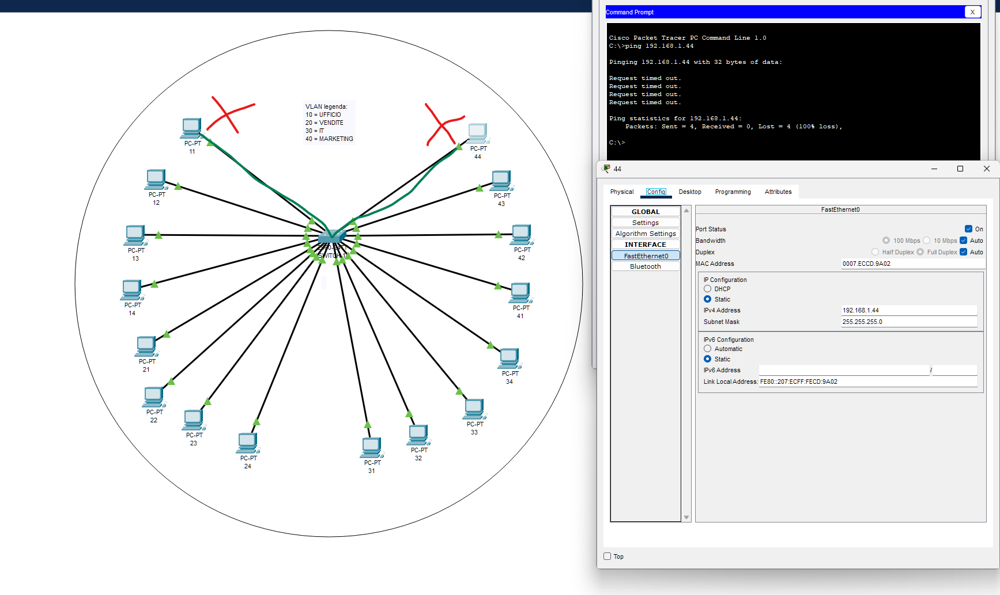
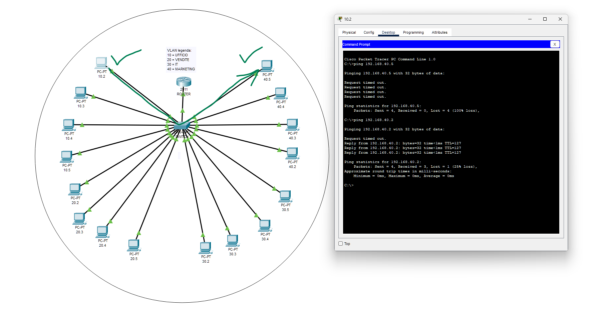

# 📐 Progetto S1/L5 📐
# Configurazione delle VLAN in Rete

Questo documento descrive due configurazioni di rete che utilizzano VLAN (Virtual Local Area Network) per segmentare e gestire la comunicazione tra dispositivi. Gli screenshot forniscono una panoramica delle impostazioni e delle differenze tra i due scenari.

## Screenshot 1: VLAN Configurata, Dispositivi Isolati

In questa prima configurazione, la rete è suddivisa in VLAN per isolare i dispositivi. Ogni gruppo di dispositivi appartiene a una VLAN specifica, impedendo la comunicazione diretta tra di loro, migliorando la sicurezza e la gestione della rete.

**Caratteristiche della Configurazione:**

- **Isolamento**: Ogni VLAN è separata dalle altre, quindi i dispositivi in una VLAN non possono comunicare con quelli di altre VLAN.
- **Scopo**: Questo tipo di configurazione è ideale per garantire la sicurezza e prevenire il traffico indesiderato tra diversi gruppi di utenti o dispositivi.

---

## Screenshot 2: VLAN Configurata con VLAN Routing

In questa configurazione, oltre alla separazione tramite VLAN, è stato implementato il **VLAN routing** per permettere la comunicazione tra dispositivi appartenenti a VLAN diverse. Questo approccio consente ai dispositivi di comunicare tra loro, se necessario, attraverso un router o un Layer 3 switch.

**Caratteristiche della Configurazione:**

- **Comunicazione tra VLAN**: Grazie al VLAN routing, i dispositivi nelle diverse VLAN possono comunicare secondo le necessità.
- **Gestione selettiva della comunicazione**: È possibile configurare regole che limitano o abilitano la comunicazione solo tra specifiche VLAN.
- **Considerazioni**: Sebbene questa configurazione permetta una comunicazione più flessibile, riduce l’efficacia dell'isolamento offerto dalle VLAN. Se il fine principale delle VLAN è la segmentazione e la sicurezza, un accesso indiscriminato tra tutte le VLAN potrebbe vanificare questo obiettivo.

---

## Considerazioni Finali

L’utilizzo delle VLAN è una pratica utile per segmentare le reti, riducendo il traffico di broadcast e migliorando la sicurezza. Tuttavia, è importante considerare il **principio di separazione**: consentire la comunicazione tra tutte le VLAN potrebbe rendere vano lo scopo delle VLAN stesse, che è isolare i dispositivi. Un approccio bilanciato è preferibile, con regole che permettano solo la comunicazione tra VLAN quando strettamente necessario.

