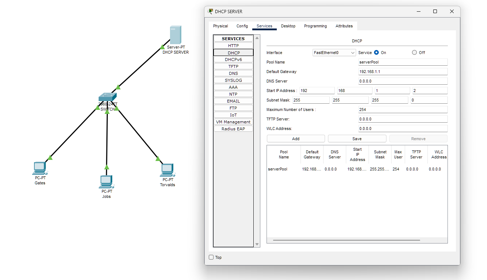

# Consegna S2/L1 ✉️

Questo repository contiene la configurazione di un server DHCP in due diversi scenari di rete.

---

## Scenari Configurati

### Scenario 1: DHCP Server con 3 Host e 1 Switch (Senza Router)
In questa configurazione di rete, abbiamo un server DHCP che assegna automaticamente gli indirizzi IP a 3 host connessi tramite uno switch. Non è presente un router nella rete. Il server DHCP è configurato per fornire agli host gli indirizzi IP in modo dinamico, permettendo una comunicazione di base tra i dispositivi.

> **Nota**: È stata fatta la scelta di non far partire l'assegnazione degli indirizzi DHCP dall'indirizzo `.1` nell'ultimo ottetto, per evitare potenziali conflitti nel caso in cui venga introdotto un router in una futura configurazione. Questo approccio lascia l'indirizzo `.1` riservato, garantendo maggiore flessibilità per espansioni di rete future.

---

### Scenario 2: DHCP e DNS Server con 3 Host e 1 Switch
Nel secondo scenario, il server DHCP assume anche il ruolo di server DNS. Oltre ad assegnare gli indirizzi IP agli host, associa un nome DNS a ciascun indirizzo IP, consentendo agli host di essere pingati per nome. Questa configurazione permette un maggiore controllo sui nomi dei dispositivi e una risoluzione dei nomi all'interno della rete.

## Configurazione

- **DHCP Server**: Configurato per assegnare automaticamente gli indirizzi IP agli host in entrambe le configurazioni.
- **DNS Server (Scenario 2)**: Configurato per mappare gli indirizzi IP degli host a nomi specifici, rendendo possibile il ping tramite nome.
- **Topologia**: 3 host, 1 switch, nessun router.

---

## Come Usare

Questa configurazione è utile per simulare ambienti di rete di base e comprendere i principi del DHCP e DNS senza la complessità di un router.
