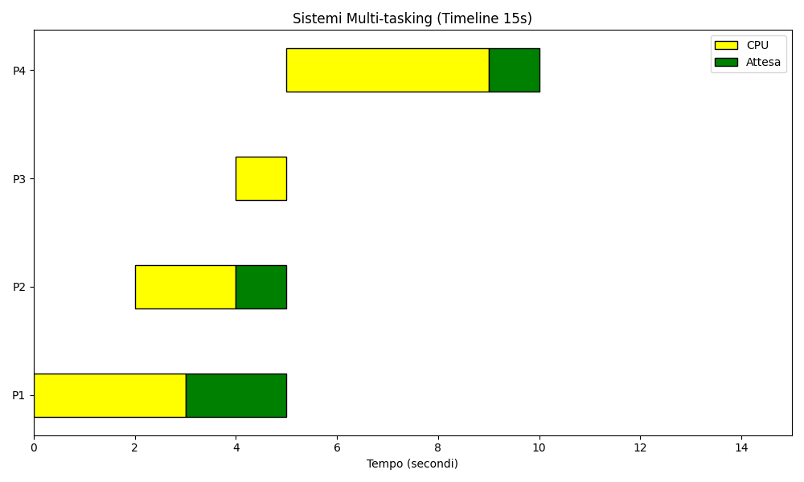

# Pratica S3/L1 ✉️ - Sistemi Operativi: Grafici di Mono-tasking, Multi-tasking e Time-sharing

Questo progetto è stato sviluppato per rappresentare graficamente i tre principali modelli di gestione dei processi nei sistemi operativi: **Mono-tasking**, **Multi-tasking** e **Time-sharing**. I grafici sono stati creati utilizzando Python e possono essere visualizzati tramite una GUI interattiva o salvati come immagini e GIF.

---

## Differenze fondamentali

### Mono-tasking
- In un sistema mono-tasking, la CPU esegue un solo processo alla volta.
- Ogni processo viene completato interamente prima che il successivo inizi.
- **Esempio**: Se un processo richiede 10 secondi, la CPU rimarrà occupata per tutto quel tempo, bloccando eventuali altri processi.

### Multi-tasking
- La CPU può passare tra più processi, migliorando l'efficienza.
- Se un processo entra in uno stato di attesa (es. in attesa di un input), la CPU può passare a un altro processo.
- **Esempio**: Se un processo A è in attesa di dati, la CPU può eseguire il processo B.

### Time-sharing
- Il tempo della CPU viene diviso in "quantum" (frazioni fisse di tempo).
- Ogni processo riceve un quantum per l'esecuzione, dopo il quale la CPU passa al processo successivo.
- **Esempio**: Se il quantum è 1 secondo, ogni processo verrà eseguito per 1 secondo prima che la CPU passi ad altri processi, in un ciclo continuo.

---

## Approccio per la generazione dei grafici

1. **Mono-tasking**
   - I processi vengono eseguiti in sequenza, rispettando i tempi di CPU (giallo) e di attesa (verde).
   - Ogni processo inizia solo dopo che il precedente è stato completato.
   


2. **Multi-tasking**
   - I processi possono sovrapporsi: se un processo è in attesa, un altro può utilizzare la CPU.
   - Questo riduce i tempi morti e migliora l'efficienza.
   


3. **Time-sharing**
   - I processi sono eseguiti ciclicamente, rispettando un quantum fisso.
   - Il grafico rappresenta l'alternanza tra i processi in base al quantum.
   


---

## Guida all'esecuzione del progetto

### Requisiti
- Python 3.10 o superiore.
- Librerie necessarie:
  - `matplotlib`
  - `tkinter`
  - `pillow` (per salvare le animazioni GIF)

### Esecuzione
1. Clonare o scaricare il progetto.
2. Installare le dipendenze richieste:
   ```bash
   pip install matplotlib pillow
   ```
3. Avviare lo script:
   ```bash
   python3 GUI.py
   ```
4. Visualizzare i grafici nella GUI. I pulsanti "Avanti" e "Termina" consentono di navigare tra i grafici.

### Modalità console (fallback)
Se la GUI non è supportata, i grafici vengono salvati automaticamente nella directory di lavoro:
- `mono_tasking_corrected.png`
- `multi_tasking_corrected.png`
- `time_sharing_corrected.png`
- `time_sharing_corrected.gif`

---

## Tecnologie e librerie utilizzate

- **Python**: Linguaggio di programmazione principale.
- **Matplotlib**: Per creare i grafici statici e animati.
- **Tkinter**: Per costruire la GUI.
- **Pillow**: Per salvare le animazioni come GIF.

---

## Conclusione

Questo progetto illustra visivamente le differenze tra i modelli di gestione dei processi, rendendo più facile comprenderne i vantaggi e gli svantaggi. È uno strumento utile per lo studio dei sistemi operativi e per chi desidera approfondire i concetti di gestione dei processi.

