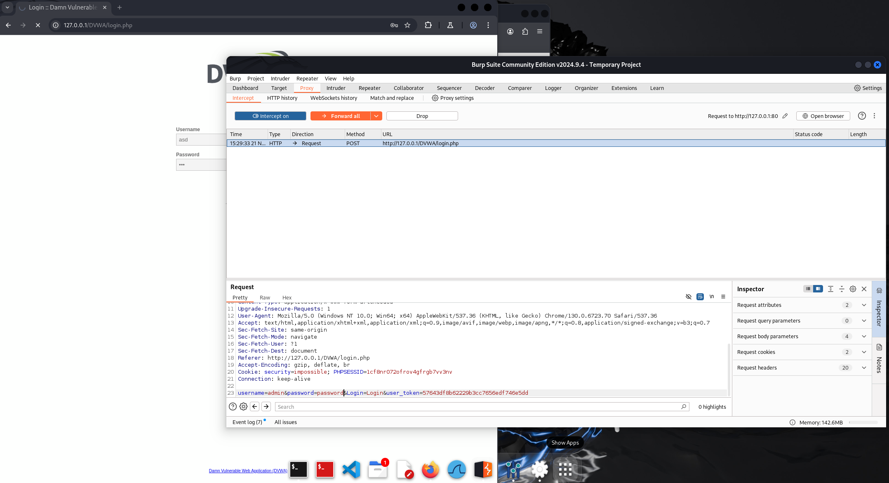

# Consegna S3/L4 - 🛡️ DVWA Installation and Burp Suite Proxy Analysis

Questo README documenta come abbiamo installato e configurato **DVWA (Damn Vulnerable Web Application)** sulla nostra VM Kali Linux, abilitando MySQL e Apache2, e come abbiamo utilizzato Burp Suite per intercettare e manipolare le comunicazioni HTTP. L'obiettivo è dimostrare come un proxy possa essere usato per analizzare e persino alterare richieste web, generando situazioni altrimenti impossibili in uno scenario reale.

---

## 🔧 **Configurazione del sistema**

### **Passaggi per installare DVWA**
1. **Installazione dei pacchetti necessari**:
   ```bash
   sudo apt update
   sudo apt install apache2 mysql-server php php-mysql unzip
   ```
2. **Download di DVWA**:
   - Scaricato da [GitHub](https://github.com/digininja/DVWA).
   ```bash
   wget https://github.com/digininja/DVWA/archive/refs/heads/master.zip
   unzip master.zip
   mv DVWA-master /var/www/html/dvwa
   ```
3. **Configurazione MySQL**:
   - Creazione del database e utente:
     ```bash
     mysql -u root -p
     CREATE DATABASE dvwa;
     CREATE USER 'dvwa_user'@'localhost' IDENTIFIED BY 'password';
     GRANT ALL PRIVILEGES ON dvwa.* TO 'dvwa_user'@'localhost';
     FLUSH PRIVILEGES;
     ```
4. **Configurazione del file `config.inc.php`**:
   - Modifica del file di configurazione di DVWA:
     ```bash
     nano /var/www/html/dvwa/config/config.inc.php
     ```
     Impostazioni:
     ```php
     $_DVWA[ 'db_user' ] = 'dvwa_user';
     $_DVWA[ 'db_password' ] = 'password';
     $_DVWA[ 'db_database' ] = 'dvwa';
     ```

5. **Permessi e configurazione finale**:
   ```bash
   sudo chown -R www-data:www-data /var/www/html/dvwa
   sudo chmod -R 755 /var/www/html/dvwa
   sudo systemctl restart apache2
   ```

6. **Accesso al sito**:
   - Accedere tramite browser su `http://127.0.0.1/dvwa`.

---

## 🌐 **Configurazione Burp Suite e Proxy**

1. **Configurare il proxy locale**:
   - Impostato **127.0.0.1:8080** in Burp Suite.
   - Nel browser, configurato il proxy HTTP su **127.0.0.1:8080** per intercettare le richieste.

2. **Certificato Burp Suite**:
   - Installato il certificato CA di Burp Suite per evitare problemi con HTTPS. (opzionale nel nostro caso)

---

## 🕵️ **Esperimento di manipolazione del login**

Abbiamo utilizzato Burp Suite Proxy per analizzare il processo di login su DVWA e dimostrare come sia possibile manipolare le richieste HTTP. Di seguito i passaggi e le osservazioni:

1. **Esempio di login errato**:
   - L'utente inserisce credenziali **errate** nel modulo di login, ad esempio:
     ```plaintext
     Username: wrong_user
     Password: wrong_password
     ```
   - La richiesta HTTP viene catturata in Burp Suite Proxy.
   
      

2. **Visualizzazione dei dati in chiaro**:
   - Burp Suite mostra i dettagli della richiesta in chiaro, incluse le credenziali errate inviate al server.
   
    

3. **Manipolazione della richiesta**:
   - Modificato **username** e **password** direttamente nel proxy con credenziali valide:
     ```plaintext
     Username: admin
     Password: password
     ```
   - Forwardata la richiesta modificata al server.
   
    

4. **Risultato "controverso"**:
   - Il server risponde con un **login riuscito**, anche se l'utente ha inizialmente inserito credenziali errate.
   - ⚠️ **Nota importante**: Questo scenario è deliberatamente forzato per scopi dimostrativi e non riflette un comportamento reale in ambienti sicuri.

---

## 🔎 **Osservazioni**

- **Visualizzazione in chiaro**: Un proxy come Burp Suite consente di esaminare le richieste HTTP, incluse informazioni sensibili come credenziali di accesso, token di sessione, ecc.
- **Manipolazione delle richieste**: La capacità di modificare il contenuto delle richieste evidenzia quanto sia fondamentale implementare protezioni robuste lato server, come:
  - Validazione rigorosa dei dati.
  - Autenticazione sicura.
  - Crittografia dei dati sensibili.

---

## 🎯 **Conclusione**

Questo esercizio dimostra come un proxy possa essere utilizzato per **intercettare e manipolare** comunicazioni web, evidenziando la necessità di una forte sicurezza applicativa. Non solo abbiamo osservato il traffico in chiaro, ma abbiamo anche simulato uno scenario assurdo e impossibile in un sistema reale ben progettato.

💡 **Riflessione**: Ogni punto debole nell’architettura può essere sfruttato. La cybersecurity non è un'opzione, ma una necessità.

--- 

🚀 **Siamo pronti a continuare il nostro viaggio nel mondo della sicurezza informatica!**
