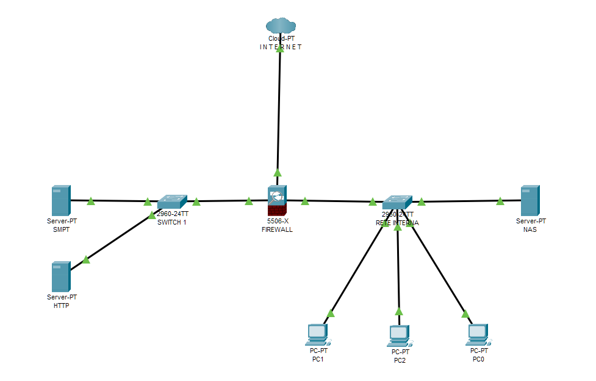

# 📐 Progetto S3/L5 📐
# 🛡️ Progetto di Segmentazione della Rete: Relazione Tecnica e Motivazioni

## **Introduzione**
Questo progetto è stato realizzato per implementare una rete segmentata che garantisse elevati standard di sicurezza, scalabilità, e organizzazione. La topologia include tre sezioni principali:
- Una rete interna con PC isolati in VLAN separate e un NAS condiviso.
- Una **DMZ (Demilitarized Zone)** con un server HTTP e un server SMTP.
- Una connessione verso Internet protetta da un firewall centrale.

L’obiettivo principale era creare una rete sicura, con una chiara segmentazione e controllo del traffico, proteggendo al contempo le risorse interne e garantendo un accesso sicuro ai servizi esposti al pubblico.

---

## **Descrizione della Topologia**
### **Rete Interna**
La rete interna include:
- Tre PC (PC0, PC1, PC2), ognuno isolato in una VLAN dedicata.
- Un NAS condiviso, che funge da repository centralizzato per la rete interna.

La scelta di segmentare i PC in VLAN separate è stata guidata dalla necessità di **ridurre la superficie di attacco** interna e **migliorare la gestione del traffico di rete**:
- 🛡️ **Isolamento dei dispositivi**: I PC non possono comunicare direttamente tra loro, il che impedisce la propagazione di attacchi come worm o malware.
- 🚦 **Controllo del traffico**: Tutto il traffico tra VLAN è instradato e controllato dal firewall, offrendo una maggiore visibilità e la possibilità di applicare politiche di sicurezza specifiche.

Il NAS è invece nella VLAN predefinita, accessibile a tutti i PC tramite regole ACL. Questo approccio garantisce una **collaborazione sicura**, permettendo l'accesso solo al traffico autorizzato.

---

### **DMZ (Demilitarized Zone)**
La DMZ è una zona di rete separata dove sono collocati:
- Un server HTTP, per offrire contenuti o applicazioni accessibili al pubblico.
- Un server SMTP, per la gestione della posta elettronica.

La separazione dei server pubblicamente accessibili dalla rete interna è una delle principali best practice in ambito di sicurezza:
- 🌐 **Protezione della rete interna**: La DMZ è progettata per essere una "buffer zone" tra Internet e la rete interna. Anche in caso di compromissione di uno dei server, gli attacchi non possono raggiungere direttamente i dispositivi interni.
- 🔒 **Controllo granulare del traffico**: Grazie al firewall, solo il traffico specifico (ad esempio, richieste HTTP o SMTP) può raggiungere i server nella DMZ, mentre tutto il resto viene bloccato.

---

### **Firewall**
Il firewall centrale funge da cuore della sicurezza della rete. È posizionato tra:
- La rete interna.
- La DMZ.
- Internet.

#### **Funzioni principali del firewall**
1. **Segmentazione del traffico**: Il firewall separa fisicamente e logicamente le reti, applicando politiche di sicurezza che determinano quali dispositivi possono comunicare tra loro e in che modo.
2. **Protezione da attacchi esterni**: Blocca tutto il traffico non autorizzato proveniente da Internet, consentendo solo connessioni specifiche ai server nella DMZ.
3. **Controllo del traffico interno**: Instrada e monitora il traffico tra le VLAN della rete interna, impedendo movimenti laterali non autorizzati.

Il firewall è configurato con regole ACL specifiche per consentire:
- Accesso HTTP e SMTP ai server nella DMZ.
- Comunicazione interna tra i PC e il NAS, ma con restrizioni.

---

## **Motivazioni delle Scelte**
1. **Segmentazione della Rete**
   - La separazione in VLAN consente di gestire il traffico in modo ottimale, riducendo il rischio di attacchi interni e migliorando le prestazioni complessive.
   - Gli host della rete interna sono isolati l’uno dall’altro, aumentando la sicurezza senza sacrificare la funzionalità.

2. **Adozione della DMZ**
   - Collocare i server pubblicamente accessibili in una zona separata garantisce che un eventuale attacco non possa propagarsi direttamente alla rete interna. È una linea di difesa essenziale per qualsiasi architettura di rete moderna.

3. **Implementazione del Firewall**
   - Il firewall agisce come un guardiano tra le reti, bloccando traffico indesiderato e monitorando ogni connessione. È la soluzione più efficace per proteggere l'intera infrastruttura da minacce esterne e interne.

---

## **Conclusioni**
Questa topologia offre una combinazione ottimale di sicurezza, scalabilità e controllo del traffico. La segmentazione tramite VLAN e DMZ, unita alla protezione fornita dal firewall, garantisce:
- **Protezione contro le minacce** sia interne che esterne.
- **Gestione centralizzata del traffico** con visibilità e controllo completi.
- **Flessibilità** per aggiungere nuovi dispositivi o servizi senza compromettere la sicurezza.

La progettazione di una rete non è solo una questione tecnica, ma un atto di responsabilità verso la protezione dei dati e delle risorse. Questo progetto dimostra come un'architettura ben pianificata possa combinare innovazione e sicurezza, mantenendo al centro la protezione degli utenti.

---

