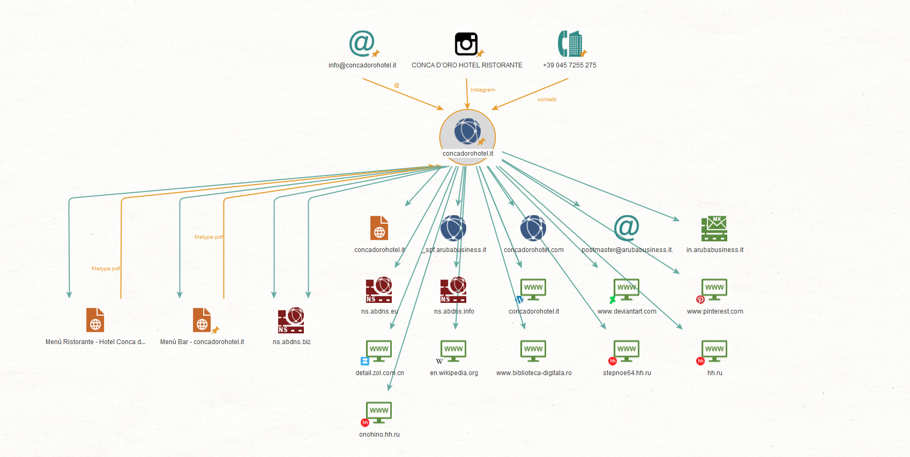

# 🛠️ Consegna S5/L1: Information Gathering

## 🎯 **Target da me selezionato:** `concadorohotel.it`

L'esercizio di oggi mira a simulare una fase di **raccolta di informazioni pubbliche (OSINT)** su un target specifico, sfruttando strumenti come **Google** e **Maltego**. Di seguito, vengono presentati i passaggi seguiti, i risultati ottenuti e l'analisi dettagliata delle informazioni raccolte.

---

# 🔍 **1. Raccolta delle Informazioni con Google**

### 📑 1.1. Pagine Indicizzate del Sito
Utilizzando la query `site:concadorohotel.it`, sono state individuate le seguenti pagine principali:
- **🏨 Home Page**: Panoramica sull'hotel e i suoi servizi.
- **🎉 Promozioni**: Informazioni sulle offerte attuali.
- **🔧 I nostri servizi**: Dettagli sui servizi offerti.
- **🍴 Food & Drinks**: Menù gastronomici.
- **🗺️ Garda e dintorni**: Attività suggerite nella zona.
- **❓ F.A.Q.**: Risposte alle domande frequenti.

---

### 📄 1.2. Documenti Pubblici Disponibili
Con la query `filetype:pdf OR filetype:docx OR filetype:xlsx site:concadorohotel.it`, sono stati trovati:
- **📜 Menù Bar**: PDF con snack e bevande disponibili.
- **📜 Menù Ristorante**: PDF contenente l'offerta culinaria.

---

### ✉️ 1.3. Indirizzi Email Associati
Con la query `"@concadorohotel.it"`, è stato individuato:
- **📧 info@concadorohotel.it**: Email pubblica per comunicazioni e prenotazioni.

---

### 📞 1.4. Contatti
Utilizzando la query `"contatti" site:concadorohotel.it`, sono stati recuperati i seguenti dettagli:
- **📍 Indirizzo**: Lungolago Europa 2, Garda (VR) - 37016  
- **📱 Telefono**: +39 045 7255275  
- **📧 Email**: info@concadorohotel.it  

---

### 🌐 1.5. Presenza sui Social Media
Con la query `"concadorohotel" site:instagram.com`, è stato trovato il profilo ufficiale:
- **📸 [@concadorohotel](https://www.instagram.com/hotel_ristorante_conca_doro/)**

---

# 🧩 **2. Analisi con Maltego**

### 🖼️ 2.1. Creazione della Mappa del Grafo
In Maltego, è stato costruito un grafo basato sulle seguenti entità iniziali:
- **🌐 Dominio**: `concadorohotel.it`
- **📧 Email**: info@concadorohotel.it
- **📞 Telefono**: +39 045 7255275
- **📄 Documenti**: Menù Bar, Menù Ristorante
- **📸 Social**: Profilo Instagram ufficiale

---

### 🔄 2.2. Trasformazioni Eseguite
Per approfondire l'analisi, sono state applicate le seguenti trasformazioni:
1. **To DNS Name - NS (name server)**: Identificati i seguenti server DNS:
   - `ns.abdns.biz`
   - `ns.abdns.info`
2. **To Domain Owner Detail**: Dominio gestito da **Aruba**.
3. **To DNS Name - MX (mail server)**: Servizio di posta elettronica configurato su **Aruba**.
4. **To Domain (Find other TLDs)**: Nessun dominio aggiuntivo trovato.
5. **To Search Web [Bing]**: Identificati alcuni siti secondari.

---

### 🆕 2.3. Nuove Entità Rilevate
L'analisi ha portato all'identificazione di:
- **🔧 Server DNS**:
  - `ns.abdns.biz`
  - `ns.abdns.info`
- **📧 Email Aggiuntive**:
  - `postmaster@arubabusiness.it` (gestione email di Aruba).
- **🔗 Siti Web Collegati**:
  - Alcuni domini di interesse secondario (es. `biblioteca-digitala.org`, `stepone4.hh.ru`).

---

### 🖼️ 2.4. Screenshot del Grafo

---

# 📊 **3. Conclusioni**

L'attività di **Information Gathering** ha prodotto i seguenti risultati:
- Il dominio `concadorohotel.it` è gestito dai server DNS di **Aruba** (`ns.abdns.biz` e `ns.abdns.info`).
- L'email **info@concadorohotel.it** è la principale per comunicazioni e prenotazioni, supportata dai servizi di posta Aruba.
- Sono stati individuati documenti pubblici utili (menù bar e ristorante) e dettagli di contatto ufficiali.
- Il profilo Instagram ufficiale è attivo e ben curato.
- Alcuni domini secondari identificati richiedono ulteriori analisi per determinarne la rilevanza.

> **📌 Nota Bene**: Tutte le informazioni raccolte sono pubblicamente accessibili.
---
