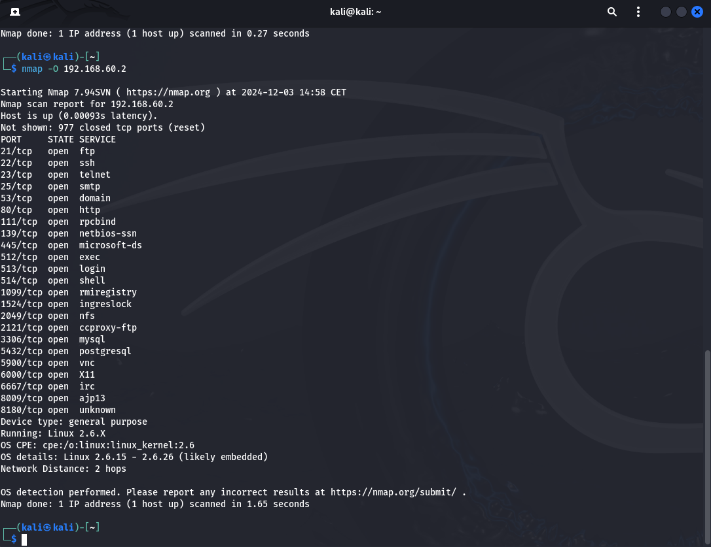
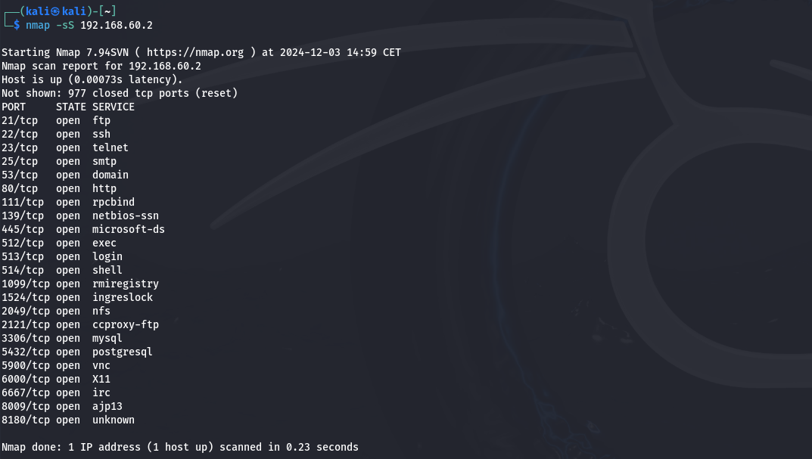
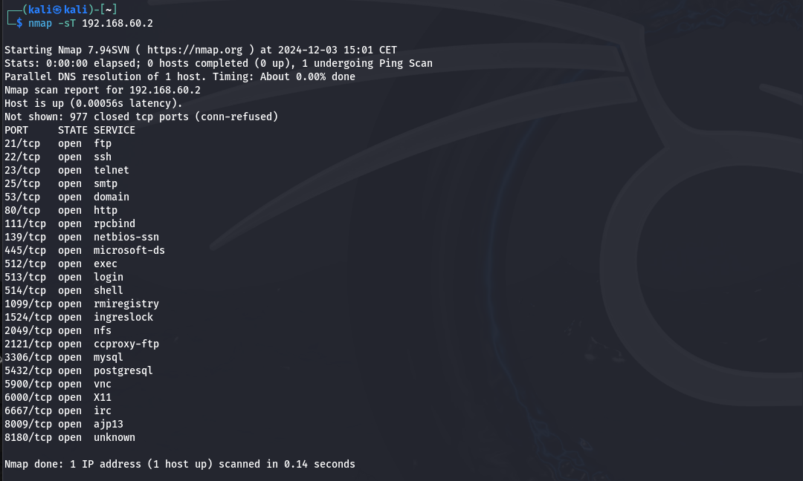
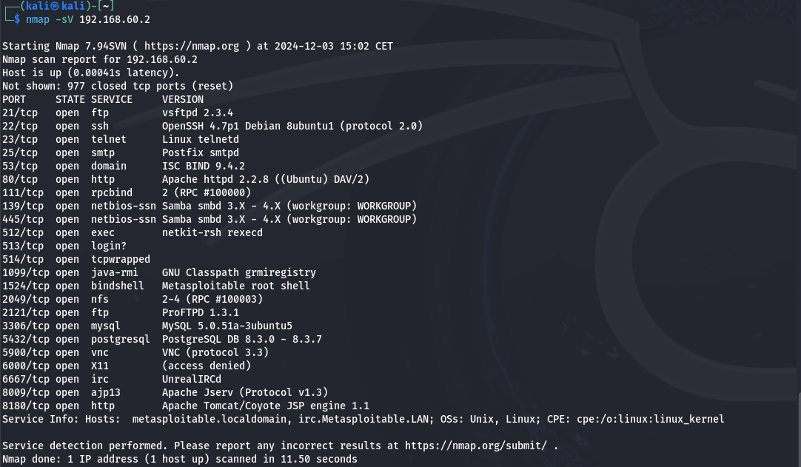

# Consegna S5/L2
# Report Scansioni Nmap

Questo documento fornisce i risultati dettagliati delle scansioni effettuate sul target **Metasploitable** (IP: 192.168.60.2). Sono state eseguite le seguenti tipologie di scansioni:

1. **Fingerprinting del Sistema Operativo**
2. **Scansione SYN**
3. **Scansione TCP Connect**
4. **Rilevamento delle Versioni dei Servizi**

## Target: Metasploitable

### Informazioni Generali:
- **Indirizzo IP**: 192.168.60.2
  
---

### Risultati delle Scansioni:

#### 1. Fingerprinting del Sistema Operativo
- **Sistema Operativo**: Linux 2.6.X

---

#### 2. Scansione SYN
- **Porte Aperte**: 21, 22, 23, 25, 53, 80, 111, 139, 445, 512, 513, 514, 1099, 1524, 2049, 2121, 3306, 5432, 5900, 6000, 6667, 8009, 8180

---

#### 3. Scansione TCP Connect
- **Porte Aperte**: 21, 22, 23, 25, 53, 80, 111, 139, 445, 512, 513, 514, 1099, 1524, 2049, 2121, 3306, 5432, 5900, 6000, 6667, 8009, 8180

---

## Confronto tra Scansione SYN e Scansione TCP Connect

### Differenze rilevate in questo caso specifico
Non sono state rilevate differenze significative tra la scansione SYN e la scansione TCP Connect. Entrambe riportano lo stesso numero di porte aperte e servizi in ascolto. Questo comportamento è dovuto a:

1. **Configurazione del target (Metasploitable)**:
   - Metasploitable è una macchina volutamente vulnerabile, configurata per rispondere in modo uniforme a entrambe le tipologie di scansione.

2. **Assenza di protezioni avanzate**:
   - Non sono presenti firewall o sistemi di difesa che possano influenzare il comportamento di una delle due scansioni.

3. **Risposte coerenti del sistema**:
   - Il sistema operativo e i servizi in ascolto non discriminano tra le due modalità di scansione, rispondendo sempre in maniera uniforme.

### Quando potrebbero emergere differenze?
- **Firewall o IDS/IPS attivi**: Sistemi di difesa potrebbero filtrare o bloccare pacchetti di una delle due scansioni.
- **Ambienti reali**: In un'infrastruttura complessa, le scansioni TCP Connect potrebbero essere più lente e rumorose, causando rilevazioni da parte dei sistemi di sicurezza.

---

#### 4. Rilevamento delle Versioni dei Servizi
- **Servizi e Versioni**:
  - Porta 21: vsftpd 2.3.4
  - Porta 22: OpenSSH 4.7p1 (Debian 8ubuntu1)
  - Porta 23: Linux Telnet
  - Porta 25: Postfix smtpd
  - Porta 53: ISC BIND 9.4.2
  - Porta 80: Apache httpd 2.2.8 ((Ubuntu) DAV/2)
  - Porta 111: rpcbind 2 (RPC #100000)
  - Porte 139/445: Samba 3.X - 4.X (Workgroup: WORKGROUP)
  - Porta 3306: MySQL 5.0.51a
  - Porta 5432: PostgreSQL 8.3
  - Porta 5900: VNC Protocol 3.3
  - Porta 6667: UnrealIRCd
  - Porta 8009: Apache JServ (Protocollo v1.3)
  - Porta 8180: Tomcat/Coyote JSP Engine 1.1
 

---

