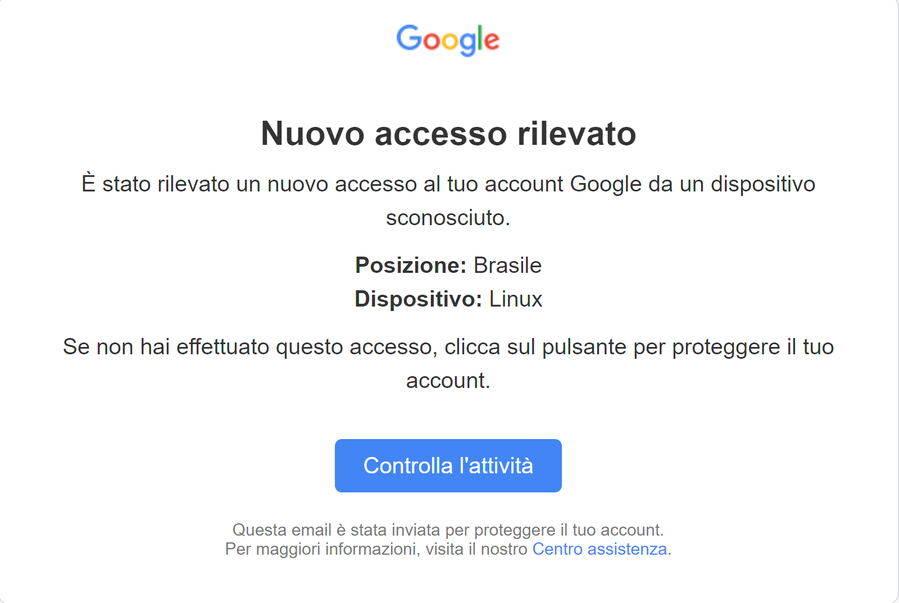

# 📐 Progetto S5/L5 📐
# 🛡️ Simulazione di Phishing su Target Account Google

## **📋 Introduzione**
Il progetto consiste nella creazione di una simulazione di phishing realistico indirizzato agli utenti di Google, un target molto comune data l’ampia diffusione di account Google in tutto il mondo. Utilizzando il contesto di una notifica di sicurezza, abbiamo generato un’email che replica accuratamente il design e il tono delle comunicazioni ufficiali di Google.

---

## **📧 Scenario Creato**
Abbiamo simulato un'email di notifica di sicurezza da Google, avvisando l'utente di un **accesso non autorizzato** rilevato sul proprio account. 

### 📄 **Dettagli dell'email:**
- **Mittente:** `no-reply@accounts.google.com`
- **Oggetto:** "🔒 Avviso di sicurezza: Nuovo accesso rilevato sul tuo account Google"
- **Corpo del messaggio:** 
  - Un avviso che informa l’utente di un tentativo di accesso sospetto da un dispositivo sconosciuto (es. dispositivo Linux in Brasile).  
  - Contiene una chiamata all'azione (CTA) per "Controllare l'attività".
- **Pulsante (CTA):** "Controlla l'attività" che reindirizza a un **falso sito di login** progettato per catturare le credenziali dell'utente.

L'email è stata progettata in **HTML**, replicando fedelmente il design delle notifiche ufficiali di Google, inclusi:
- 🎨 **Logo ufficiale Google.**
- ✅ Colori e font coerenti con le comunicazioni originali.

---

## **🤔 Perché l'email potrebbe sembrare credibile**
L'email è progettata per sembrare autentica grazie ai seguenti fattori:
1. **📤 Mittente realistico:** L'indirizzo email del mittente (`no-reply@accounts.google.com`) è simile a quello utilizzato da Google.
2. **🎨 Design coerente:** Il layout dell'email imita perfettamente le notifiche di sicurezza di Google.
3. **⚠️ Contenuto contestuale:** 
   - La notifica sfrutta un evento comune, come un **accesso sospetto**, per creare urgenza.
   - Questo è un classico esempio di **ingegneria sociale** per indurre l'utente ad agire rapidamente.
4. **👆 Pulsante visibile e intuitivo:** Il pulsante "Controlla l'attività" è prominente, invitando l'utente a cliccare.

---

## **🚨 Elementi che potrebbero far sorgere sospetti**
Nonostante l'email sembri autentica, ci sono alcuni **dettagli sottili** che potrebbero destare sospetti:
1. **🔍 Assenza di personalizzazione:**
   - Non viene riportato l’indirizzo email del destinatario sotto il titolo "Nuovo accesso rilevato".  
   - Le email ufficiali di Google includono questo dettaglio per maggiore autenticità.
2. **🌐 Link sospetto:**
   - Il pulsante "Controlla l'attività" reindirizza a un dominio falso (`http://google-support-secure-login.com`) invece che al dominio ufficiale (`https://accounts.google.com`).
3. **📚 Possibili errori minori:**  
   - Piccole incongruenze grammaticali o stilistiche potrebbero insospettire un utente esperto.

Tuttavia, l'utente medio potrebbe **non notare questi segnali**, lasciandosi ingannare facilmente.

---

## **🚀 Futura attuazione e testing**
Per testare la simulazione in un ambiente controllato, si può ricorrere al tool [**GoPhish**](https://github.com/hkmodd/CS0724IT/tree/main/UNIT%202/S5/L5).

**📌 Nota Bene:** Questo progetto è puramente a scopo **didattico**. :)

---

## **🔍 Conclusioni**
Il progetto S5/L5 ha dimostrato come un’email di phishing possa essere resa credibile utilizzando:
- 🎭 Tecniche di **ingegneria sociale**.
- 🎨 Design **visivamente autentico**.

Questa simulazione evidenzia:
- La necessità di educare gli utenti su come riconoscere i segnali di phishing.
- L'importanza di verificare sempre i dettagli di un'email (es. dominio, personalizzazione) prima di interagire con essa.

---
