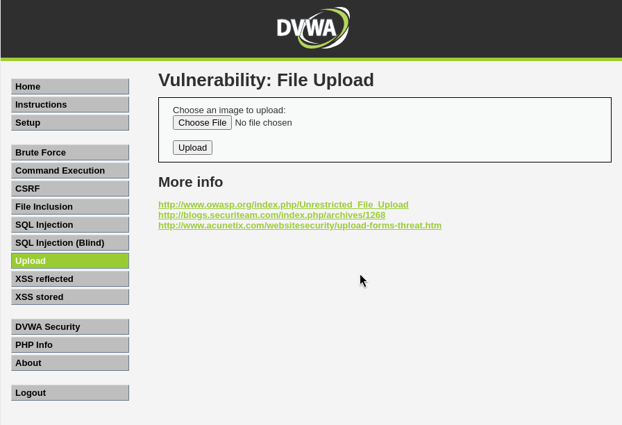
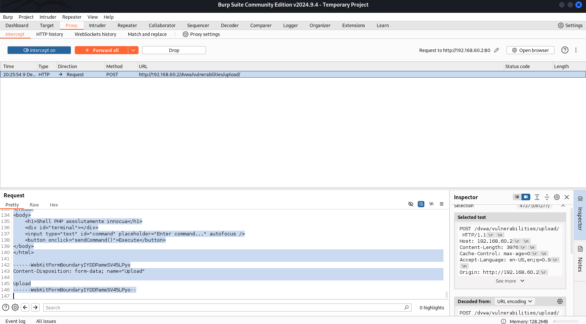
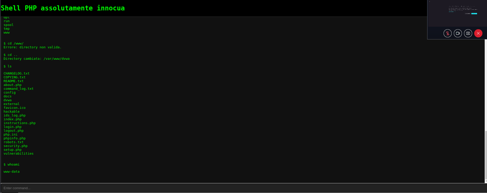
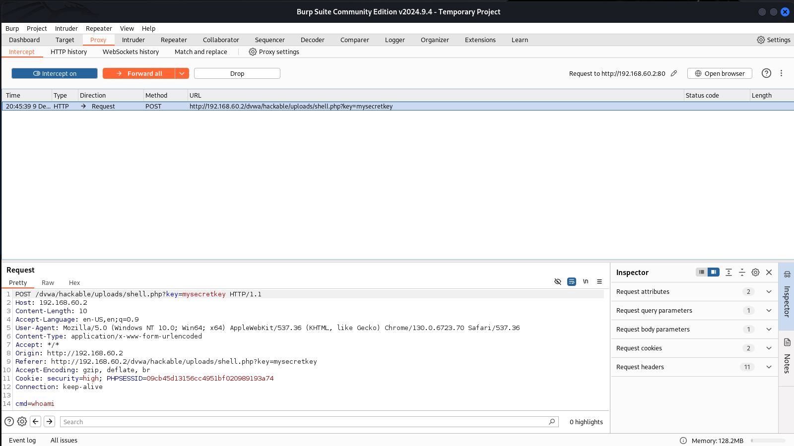
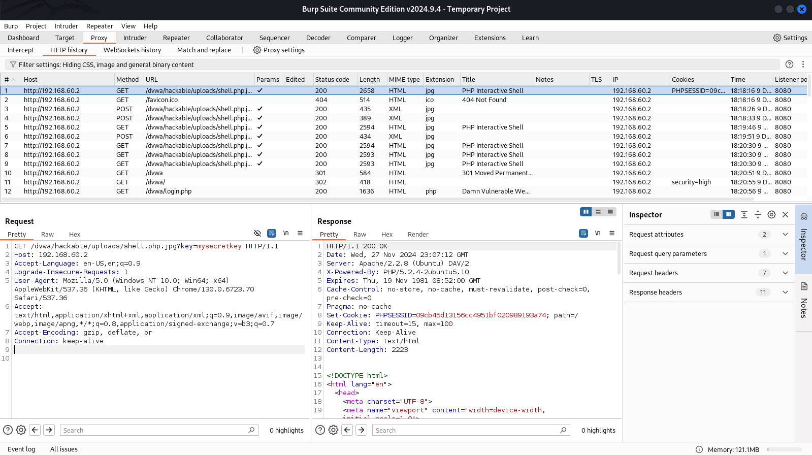

# 📝 Consegna S6/L1
## <h1 align="center">Exploit File Upload | Programmazione Shell PHP per Controllo Remoto su Metasploitable.</h1>

---

## **🎯 Obiettivo**: Creare e utilizzare una shell PHP per ottenere il controllo remoto completo della macchina Metasploitable, intercettare poi le richieste mediante BurpSuite, familiarizzare con gli ambienti e i tool.

---

# **✅ Passaggi eseguiti**

## **1️⃣ Configurazione dell'ambiente**
1. **🌐 Connessione tra Kali e Metasploitable**:
   - Le macchine sono configurate per comunicare tra loro.
   - Test di connettività eseguito con:
     ```bash
     ping 192.168.60.2
     ```
   - 🔄 Risultato: connettività confermata.

2. **🔒 Accesso alla DVWA su Metasploitable**:
   - L'applicazione web vulnerabile è stata raggiunta tramite:
     ```
     http://192.168.60.2/dvwa
     ```
   - Il livello di sicurezza è stato impostato inizialmente su **Low** per consentire l'upload della shell.
3. **🖋️ Creazione della shell `shell.php`**:
   - La shell PHP include funzionalità avanzate:
     - Esecuzione comandi remoti.
     - Navigazione persistente nel file system.
     - Interfaccia interattiva con output dinamico tramite AJAX.

---

## **2️⃣ Caricamento della Shell**
 **📤 Upload della shell su DVWA**:
   - File caricato tramite la sezione **File Upload**.


 **🔑 Accesso protetto alla shell**:
   - La chiave `mysecretkey` è obbligatoria per accedere alla shell. Questo garantisce che solo chi conosce la chiave possa utilizzarla.
   - Test di caricamento riuscito con accesso al file tramite browser:
     ```
     http://192.168.60.2/dvwa/hackable/uploads/shell.php?key=mysecretkey
     ```

---

## **3️⃣ Intercettazione Upload con BurpSuite**

1. **🛠️ Configurazione**:
   - Configurato BurpSuite per intercettare il traffico HTTP durante l'upload della shell `shell.php`.

2. **🔎 Intercettazione delle richieste HTTP**:
   - Durante il caricamento della shell tramite la sezione **File Upload** di DVWA, BurpSuite ha intercettato la seguente richiesta POST:
     ```
     POST /dvwa/vulnerabilities/upload/ HTTP/1.1
     Host: 192.168.60.2
     Content-Length: 3976
     Content-Type: multipart/form-data; boundary=----WebKitFormBoundaryIYDDPameSV45LPyo
     ...
     ------WebKitFormBoundaryIYDDPameSV45LPyo
     Content-Disposition: form-data; name="uploaded"; filename="shell.php"
     Content-Type: application/x-php
     ...
     ```

   - Dall'intercettazione, è evidente che il file caricato è uno script PHP malevolo, ovvero una shell remota progettata per ottenere il controllo della macchina target. Questo dimostra come un'implementazione scorretta della gestione dei file caricati possa esporre il sistema a gravi rischi di compromissione.

   - La shell, una volta caricata, è stata localizzata nella directory specificata:  
     ```
     http://192.168.60.2/dvwa/hackable/uploads/shell.php?key=mysecretkey
     ```

3. **🔍 Analisi**:
   - La richiesta includeva il payload PHP della shell, che è stato elaborato dal server, consentendo così l'accesso remoto.
   - La chiave segreta `mysecretkey` ha fornito un ulteriore livello di autenticazione, assicurando che solo gli utenti autorizzati potessero interagire con la shell.

4. **📸 Screenshot Intercettazione**:
   

---

## **4️⃣ Utilizzo della Shell**
1. **⚡ Esecuzione comandi remoti**:
   - Eseguiti comandi come:
     - `ls` - Per elencare file e directory.
     - `whoami` - Per identificare l'utente corrente.

2. **🗂️ Navigazione del file system**:
   - Comandi `cd` per cambiare directory:
     - Esempio: `cd /var/www/html`
   - 🔄 Navigazione persistente grazie alla gestione delle sessioni.

3. **🛠️ Interazione con strumenti**:
   - Eseguito `nano` per modificare file in modalità interattiva:
     - Esempio: `nano test.txt`
   - La shell fornisce una vera esperienza terminale.

4. **📁 Caricamento e download file**:
   - Caricato un file su Metasploitable:
     ```bash
     curl -F "file=@example.txt" "http://192.168.60.2/dvwa/hackable/uploads/shell.php?key=mysecretkey"
     ```
   - Scaricato un file dalla macchina:
     ```bash
     curl "http://192.168.60.2/dvwa/hackable/uploads/shell.php?key=mysecretkey&action=download&file=/etc/passwd" -o passwd.txt
     ```


### **🔧 Come la Shell Fornisce Controllo Completo**
1. **Esecuzione Comandi**:
   - Ogni comando viene inviato tramite HTTP POST e processato direttamente dalla macchina Metasploitable usando `shell_exec`. L'output viene restituito come risposta HTTP, visibile nel terminale integrato.

2. **Persistenza delle directory**:
   - La shell utilizza variabili di sessione per mantenere lo stato della directory corrente, replicando un'esperienza simile al terminale.

3. **Interfaccia Interattiva**:
   - Utilizzando AJAX, l'interfaccia aggiorna dinamicamente il terminale senza necessità di ricaricare la pagina.

4. **Interazione con strumenti avanzati**:
   - La shell supporta strumenti terminali (`nano`, `vi`, `tree`, ecc.), fornendo un accesso completo e interattivo.

---

## **4️⃣ Intercettazioni comandi Shell con BurpSuite**
1. **🛠️ Configurazione**:
   - Configurato BurpSuite per intercettare il traffico HTTP.

2. **🔎 Intercettazione delle richieste HTTP**:
   - Esempio di richiesta intercettata:
     ```
     GET /dvwa/hackable/uploads/shell.php?key=mysecretkey&action=ls
     ```
   - Catturato il comando POST per eseguire `whoami`:
     ```
     POST /dvwa/hackable/uploads/shell.php?key=mysecretkey
     Body: cmd=whoami
     ```


---

## **5️⃣ Bypass della Sicurezza High su DVWA**

1. **🔧 Configurazione della Sicurezza High**:
   - La sicurezza della DVWA è stata in seguito configurata su **High**, implementando restrizioni "più rigide" per il caricamento dei file.

2. **🔎 Metodo di Elusione**:
   - Nonostante la configurazione avanzata, è stato possibile caricare la shell `shell.php` rinominata in `.jpg`. Questo ha eluso il sistema di controllo che permette l'upload di file `.jpg` solo se:
     - Il file è lungo almeno **100000 byte**.
   - La shell è stata scritta in modo tale da rispettare la lunghezza minima richiesta, aggirando efficacemente le restrizioni.

3. **📤 Dettagli Tecnici**:
   - Il file è stato caricato tramite la sezione **File Upload**, ed è stato possibile eseguirlo come script PHP nonostante l'estensione `.jpg`.

4. **📸 Screenshot dell'Intercettazione**:


---

# **📌 Conclusione**
La shell PHP caricata consente un controllo remoto completo della macchina Metasploitable. L'esperimento dimostra come vulnerabilità come l'upload di file non protetti possano esporre una macchina a rischi significativi. Attraverso questa shell è stato possibile eseguire comandi, navigare nel file system e interagire con strumenti di sistema senza restrizioni. Ma ci mostra inoltre che con BurpSuite è stato possibile intercettare questa azione di upload, per identificarla e prevenirla.


