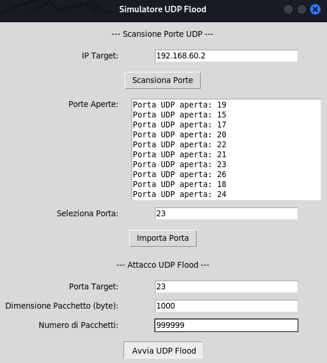

# 📝 Consegna S6/L3 
# Attacchi DDoS 🎯

## 💡 **Introduzione**
Gli attacchi DDoS (Distributed Denial of Service) sono azioni mirate a sovraccaricare un sistema, rendendo i servizi indisponibili per gli utenti legittimi. Questo esercizio simula un attacco **UDP Flood**, dove pacchetti UDP vengono inviati in massa verso una macchina target.

L'obiettivo è stato costruire un programma in Python per:
1. Scansionare le porte di un target.
2. Eseguire un attacco UDP Flood su una porta specifica.

---

## 📋 **Funzionalità del Programma**

### 🛠️ **Scansione delle Porte**
- Identifica le porte aperte su un IP specificato dall'utente.
- Utilizza il protocollo TCP per rilevare i servizi in ascolto.
- Mostra tutte le porte aperte trovate.

### ⚡ **Attacco UDP Flood**
- Invia pacchetti UDP di dimensioni configurabili verso una porta selezionata.
- Permette di scegliere il numero di pacchetti da inviare.
- Fornisce un'interfaccia grafica per una facile gestione.

---

## 🧩 **Struttura del Programma**
Il programma è diviso in due sezioni principali:

### **1. Scansione delle Porte**
1. L'utente inserisce l'IP target.
2. Il programma esegue una scansione delle porte su tutte le 65.535 porte TCP.
3. Le porte aperte vengono visualizzate in un elenco.
4. L'utente può selezionare una porta dall'elenco per l'attacco.

### **2. Attacco UDP Flood**
1. L'utente specifica:
   - IP target (importabile dalla sezione precedente).
   - Porta target.
   - Dimensione dei pacchetti (default: 1024 byte).
   - Numero di pacchetti da inviare.
2. Il programma invia pacchetti verso il target usando un socket UDP.

---

## 🖥️ **Come Testare il Programma**

### **Ambiente Consigliato**
Per garantire un utilizzo sicuro, consigliamo di eseguire i test in un ambiente controllato, come:
- Una macchina virtuale con **Metasploitable**.
- Una macchina virtuale con **Windows XP**.

### **Verifica del Traffico UDP**
Per assicurarsi che i pacchetti arrivino al target:
1. Usa strumenti di monitoraggio del traffico come `tcpdump` o `Wireshark`:
   ```bash
   sudo tcpdump -i eth0 udp port <PORTA>
   ```
2. Controlla che i pacchetti UDP siano visibili nel traffico catturato.

### **Servizio in Ascolto**
Se la porta scelta non ha un servizio in ascolto:
- Configura un server UDP temporaneo:
  ```bash
  nc -u -l -p <PORTA>
  ```
- Verifica la ricezione dei pacchetti.

---

## 📝 **Esecuzione del Programma**

1. **Avviare il Programma**
   - Assicurati di avere Python installato.
   - Esegui lo script:
     ```bash
     python3 UDPDDoS.py
     ```

2. **Scansionare le Porte**
   - Inserisci l'IP del target.
   - Clicca su "Scansiona Porte".
   - Visualizza l'elenco delle porte aperte.

3. **Configurare l'Attacco**
   - Seleziona una porta dall'elenco e importala.
   - Configura dimensione e numero dei pacchetti.
   - Clicca su "Avvia UDP Flood".



4. **Monitorare il Target**
   - Usando `sudo tcpdump -i eth0 udp port 23` monitoriamo e verifichiamo che l'attacco stia funzionando sul target Metasploitable, risultato screenshot:


---

