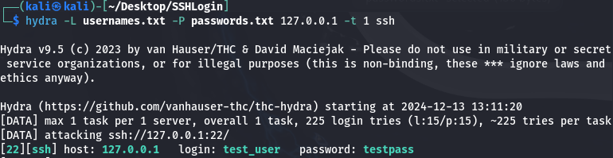

# Progetto S6/L5: Brute Force SSH con Hydra

## **Obiettivo dell'Esercizio**

L'obiettivo dell'esercizio è stato duplice:
1. Fare pratica con lo strumento **Hydra** per effettuare un attacco di brute force sull'autenticazione SSH.
2. Configurare un servizio SSH, consolidando la conoscenza di gestione e protezione dei servizi di rete.

---

## **Passaggi Seguiti**

### **1. Configurazione del Servizio SSH**

1. **Creazione dell'utente per il test**:
   ```bash
   sudo adduser test_user
   ```
   - Nome utente: `test_user`
   - Password: `testpass`

2. **Attivazione del servizio SSH**:
   ```bash
   sudo service ssh start
   ```

3. **Modifica del file di configurazione SSH** (opzionale):
   - Per permettere configurazioni avanzate, abbiamo modificato `/etc/ssh/sshd_config`:
     ```bash
     sudo nano /etc/ssh/sshd_config
     ```
     - Esempio di modifica: 
       ```
       PermitRootLogin yes
       MaxStartups 10:30:60
       ```
   - Riavvio del servizio SSH:
     ```bash
     sudo service ssh restart
     ```

4. **Verifica del servizio SSH**:
   - Recupero dell'indirizzo IP:
     ```bash
     ifconfig
     ```
   - Test della connessione:
     ```bash
     ssh test_user@127.0.0.1
     ```

### **2. Creazione delle Wordlist Personalizzate**

Abbiamo creato due file di wordlist per simulare un attacco mirato:

- **Wordlist delle password**:
  ```bash
  echo -e "password\n123456\nadmin123\ntestpass\nqwerty\nletmein\npassword1\nwelcome\n12345678\nchangeme\nroot123\ntoor\niloveyou\nsecurepass\npassword123" > passwords.txt
  ```

- **Wordlist dei nomi utente**:
  ```bash
  echo -e "test_user\nadmin\nroot\nuser1\nguest\noperator\nsupport\nmanager\ndeveloper\nservice\nbackup\ntester\naccount\nsuperuser\nsysadmin" > usernames.txt
  ```

### **3. Utilizzo di Hydra per il Brute Force**

Abbiamo utilizzato **Hydra** per effettuare il brute force sul servizio SSH:

1. **Comando per Hydra**:
   ```bash
   hydra -L usernames.txt -P passwords.txt 127.0.0.1 -t 1 ssh
   ```
   - `-L usernames.txt`: Specifica il file delle wordlist per i nomi utente.
   - `-P passwords.txt`: Specifica il file delle wordlist per le password.
   - `127.0.0.1`: Indica il server SSH (localhost).
   - `-t 1`: Esegue un thread alla volta per evitare errori di connessione.

2. **Risultato**:
   - Hydra ha identificato con successo la combinazione:
     - Nome utente: `test_user`
     - Password: `testpass`
	 


### **4. Risoluzione degli Errori Riscontrati**

Durante il test iniziale con wordlist più grandi, abbiamo riscontrato errori dovuti a **Troppi tentativi simultanei**: 
- Risolto riducendo i thread con `-t 1`.

---

## **Conclusioni e Considerazioni**

L'esercizio ha dimostrato:
- L'efficacia degli attacchi brute force con dizionari mirati.

### **Miglioramenti Suggeriti per la Sicurezza**
- **Usare chiavi SSH** invece delle password.
- **Limitare i tentativi di login** e disabilitare utenti inutilizzati.

---

## **File Utilizzati**

- `usernames.txt`: Wordlist per i nomi utente.
- `passwords.txt`: Wordlist per le password.

Questi file sono inclusi nella directory del progetto per eventuali test futuri.

---

## **Comandi Chiave Riassunti**

1. Creazione dell'utente:
   ```bash
   sudo adduser test_user
   ```

2. Attivazione del servizio SSH:
   ```bash
   sudo service ssh start
   ```

3. Esecuzione di Hydra:
   ```bash
   hydra -L usernames.txt -P passwords.txt 127.0.0.1 -t 1 ssh
   
