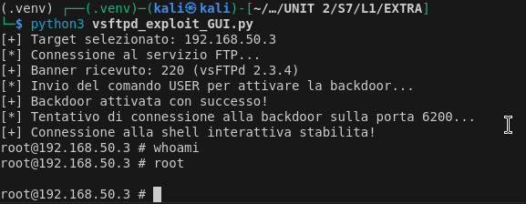

# 🚀 Extra S7/L1 - Implementazione manuale dell'exploit vsftpd 2.3.4

## 🎯 Obiettivo

Durante questa esercitazione, abbiamo analizzato il codice dell'exploit **Metasploit** per la vulnerabilità in `vsftpd 2.3.4`, comprendendone il funzionamento e implementando un **script Python** che replica il comportamento dell'exploit. Questo ci ha permesso di ottenere una **shell interattiva** completamente funzionale, migliorata con una **interfaccia grafica (GUI)** per selezionare l'indirizzo IP del target da attaccare.

---

## 🛠️ Analisi del codice Metasploit

Il codice dell'exploit Metasploit esegue i seguenti passaggi principali:
1. **Connessione alla porta FTP (21)** del server vulnerabile e ricezione del banner.
2. Invio del comando `USER <random>:)` per attivare la backdoor.
3. Invio di `PASS <random>` per completare il protocollo FTP (anche se non necessario).
4. Tentativo di connessione alla porta **6200**, aperta dalla backdoor.
5. Interazione con la shell fornita dalla backdoor sulla porta 6200.

Abbiamo replicato questi passaggi in Python.

---

## 🧑‍💻 Implementazione manuale dello script Python

Lo script Python **vsftpd_exploit.py** riproduce il funzionamento dell'exploit di Metasploit:
1. **Attivazione della backdoor**:
   - Connessione alla porta 21.
   - Invio dei comandi `USER` e `PASS` per attivare la porta 6200.
2. **Shell interattiva**:
   - Connessione alla porta 6200.
   - Apertura di una shell completa con gestione dell'input e output.

**Caratteristiche dello script:**
- Utilizzo della libreria **socket** per gestire la comunicazione TCP.
- Shell interattiva migliorata con un prompt personalizzato: `root@<target-ip> #`.

---

## ✅ Mission Success 🚀

Grazie a questa implementazione, è possibile:
1. Sfruttare manualmente la vulnerabilità di `vsftpd 2.3.4` senza dipendere da Metasploit.
2. Comprendere il funzionamento dell'exploit a livello di protocollo TCP.
3. Interagire con il target in modo intuitivo attraverso una shell interattiva.
4. Utilizzare una GUI semplice e funzionale per scegliere l'indirizzo IP target.

---

