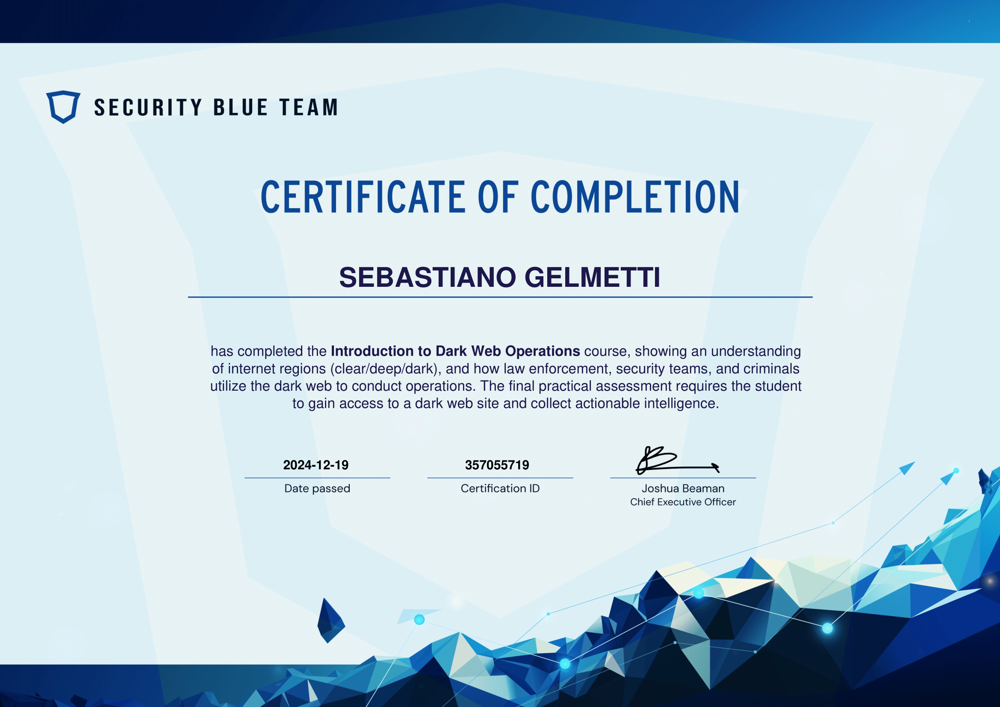
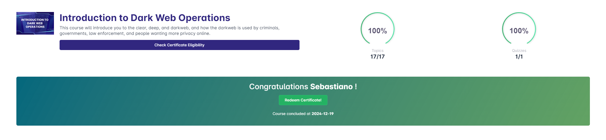

# Certificazione "Introduction to Dark Web Operations"

## 🖥️ **Iscrizione e Corso**
- Ci siamo iscritti al portale **Security Blue Team** creando un account con la nostra email. Una volta registrati, abbiamo selezionato il corso gratuito "Introduction to Dark Web Operations".
- Il corso comprendeva **17 moduli teorici**, ognuno corredato da informazioni pratiche sull'utilizzo del dark web e sulle tecniche di investigazione. 

## 🔍 **Il Quiz Finale**
Il quiz finale è stato un momento coinvolgente e pratico, permettendoci di applicare le conoscenze acquisite durante il corso.

1. **Accesso al sito dark web:**
   - Abbiamo indagato su un forum nel dark web per recuperare inizialmente le credenziali d'accesso necessarie. Questa fase ci ha richiesto di analizzare attentamente il contenuto del sito per decifrare gli indizi nascosti.

2. **Investigazione su un trafficante di droga:**
   - Una volta dentro il forum, ci è stato richiesto di individuare un sospetto trafficante di droga. Per farlo, abbiamo analizzato una serie di messaggi codificati in **hex**.
   - Decodificando queste informazioni, siamo riusciti a estrarre dettagli chiave relativi alla sua identità e alle sue attività illecite.

3. **Risoluzione:**
   - Completati i compiti, abbiamo inviato le informazioni raccolte. Il quiz si è rivelato non solo un esercizio tecnico, ma anche un'esperienza avvincente di simulazione di investigazione reale.

## 🏆 **Certificazione**
Al termine del quiz, abbiamo raggiunto il punteggio massimo, ottenendo così il certificato di completamento del corso.

## 🤔 **Riflessioni**
- Il corso è stato un'ottima introduzione pratica al mondo della sicurezza informatica e delle operazioni sul dark web.
- L'esercitazione finale è stata particolarmente interessante per via della combinazione tra teoria e pratica, stimolando il ragionamento critico e l'uso di strumenti di decodifica.

