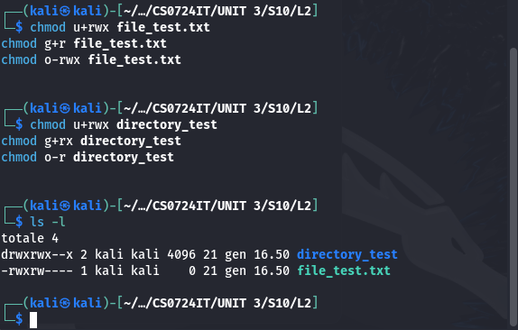

# 📝 Consegna S10/L2
# 📂 Gestione dei Permessi in Linux

## 📝 Introduzione
In questo esercizio abbiamo configurato e gestito i permessi di lettura, scrittura ed esecuzione per file e directory in un sistema Linux. L'obiettivo era comprendere l'utilizzo dei comandi Linux per la gestione dei permessi e verificarne il funzionamento.

---

## ⚙️ Procedura

### 1️⃣ Creazione del file e della directory
- È stato creato un file denominato `file_test.txt` e una directory chiamata `directory_test` usando i comandi:
  ```bash
  echo "Testo di prova" > file_test.txt
  touch directory_test/nuovo_file.txt
  ```
- 🔍 **Screenshot**:


---

### 2️⃣ Modifica dei permessi
- Abbiamo modificato i permessi per il file e la directory:
  - **File `file_test.txt`:**
    ```bash
    chmod u+rwx file_test.txt
    chmod g+r file_test.txt
    chmod o-rwx file_test.txt
    ```
  - **Directory `directory_test`:**
    ```bash
    chmod u+rwx directory_test
    chmod g+rx directory_test
    chmod o-r directory_test
    ```
- 🔍 **Screenshot**:


---

### 3️⃣ Test dei permessi
- È stato verificato il funzionamento dei permessi:
  - **File `file_test.txt`:** Abbiamo scritto del testo per verificarne i permessi di scrittura.
    ```bash
    echo "Testo di prova" > file_test.txt
    ```
  - **Directory `directory_test`:** È stato creato un file vuoto per verificare i permessi di creazione.
    ```bash
    touch directory_test/nuovo_file.txt
    ```
- 🔍 **Screenshot**:



---

## 📊 Analisi dei risultati
- **File `file_test.txt`:** 
  - Permessi configurati correttamente per l'utente (lettura, scrittura ed esecuzione).
  - Solo lettura per il gruppo.
  - Nessun permesso per gli altri utenti.
- **Directory `directory_test`:** 
  - Accesso completo per l'utente.
  - Lettura ed esecuzione per il gruppo.
  - Nessun accesso per gli altri utenti.

---

## 📌 Conclusioni
L'esercizio ha permesso di:
- ✅ Comprendere i comandi `chmod` per modificare i permessi.
- ✅ Verificare il corretto funzionamento dei permessi su file e directory.
- ✅ Applicare una configurazione sicura limitando i permessi agli utenti non autorizzati.

