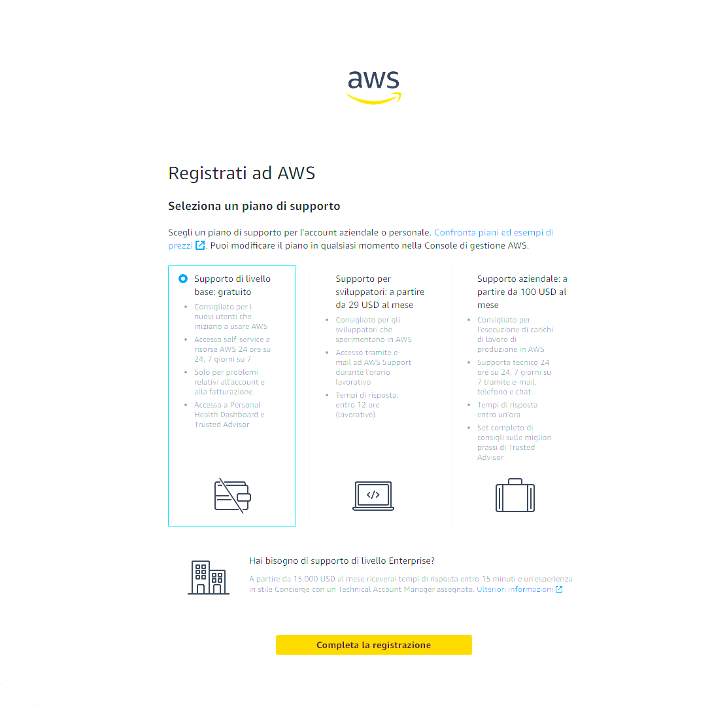
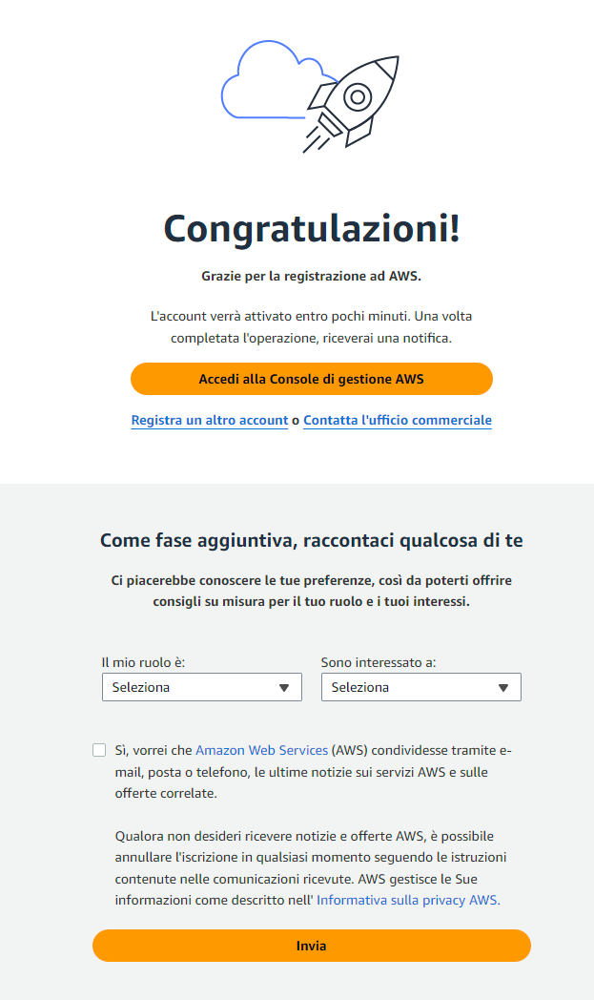

# 📝 Consegna S10/L4
# ☁️ Backup, Cloud e RAID

## Introduzione 🌐
In questo progetto, ho approfondito i concetti di **Backup**, **Cloud Computing** e **RAID**, fondamentali per la protezione e l'affidabilità dei dati aziendali. Ho svolto le attività richieste rispettando tutti i punti indicati, integrando esempi pratici e riferimenti alle migliori pratiche del settore. 💪

---

## 1️⃣ Ricerca sui principali fornitori di servizi cloud

### **Amazon Web Services (AWS)**
- **Caratteristiche principali:**
  - Leader globale nel mercato del cloud computing con il 32% di quota di mercato nel 2024.
  - Offre una vasta gamma di servizi, inclusi calcolo, storage, database, intelligenza artificiale e machine learning.
  - Supporta soluzioni scalabili e personalizzabili per aziende di ogni dimensione.
- **Esempio pratico:** [Amazon EC2](https://aws.amazon.com/ec2/) per server virtuali scalabili e [Amazon S3](https://aws.amazon.com/s3/) per lo storage sicuro dei dati.

### **Microsoft Azure**
- **Caratteristiche principali:**
  - Quota di mercato del 23%, posizionandosi come secondo principale fornitore di cloud computing.
  - Integrazione avanzata con i prodotti Microsoft, come Office 365 e Dynamics 365.
  - Supporto a soluzioni ibride tramite Azure Stack per combinare infrastrutture locali e cloud.
- **Esempio pratico:** [Azure Virtual Machines](https://azure.microsoft.com/en-us/services/virtual-machines/) per configurazioni personalizzate e [Azure Blob Storage](https://azure.microsoft.com/en-us/services/storage/blobs/) per archiviazione.

### **Google Cloud Platform (GCP)**
- **Caratteristiche principali:**
  - Terzo nel mercato con il 10% di quota globale.
  - Focalizzato su strumenti avanzati di intelligenza artificiale e machine learning, come [TensorFlow](https://www.tensorflow.org/).
  - Strumenti analitici potenti come [BigQuery](https://cloud.google.com/bigquery).
- **Esempio pratico:** [Google Kubernetes Engine (GKE)](https://cloud.google.com/kubernetes-engine/) per la gestione di container e [Cloud Storage](https://cloud.google.com/storage) per backup scalabili.

---

## 2️⃣ Descrizione dei modelli di servizio cloud

### **IaaS (Infrastructure as a Service)**
- **Definizione:** Fornisce risorse virtuali come server, storage e reti su richiesta.
- **Esempio pratico:** Amazon EC2 consente di creare server virtuali scalabili per ambienti aziendali.
- **Vantaggi:**
  - Maggiore controllo sull'infrastruttura.
  - Costi variabili in base all'utilizzo.
  - Adatto a soluzioni personalizzate.

### **PaaS (Platform as a Service)**
- **Definizione:** Offre una piattaforma per lo sviluppo, test e distribuzione di applicazioni senza gestire l'infrastruttura sottostante.
- **Esempio pratico:** Google App Engine per applicazioni web scalabili.
- **Vantaggi:**
  - Facilita lo sviluppo rapido.
  - Scalabilità automatica delle risorse.
  - Riduce la complessità di gestione.

### **SaaS (Software as a Service)**
- **Definizione:** Applicazioni software accessibili tramite internet senza necessità di installazione locale.
- **Esempio pratico:** Microsoft 365 per la produttività aziendale.
- **Vantaggi:**
  - Aggiornamenti automatici gestiti dal fornitore.
  - Facilità d'uso su più dispositivi.
  - Modello di pagamento a consumo (abbonamento).

---

## 3️⃣ Esempio di creazione di un account di prova

### **AWS Free Tier**
Per esplorare i servizi cloud, ho seguito questi passaggi per creare un account gratuito:

1. Visitare il sito ufficiale di **AWS**.
2. Cliccare su “Create a Free Account”.
3. Inserire le informazioni personali richieste.
4. Selezionare il piano **AWS Free Tier**, che include:
   - 750 ore/mese su Amazon EC2.
   - 5 GB di storage standard su Amazon S3.
5. Verificare l'identità tramite carta di credito e telefono.
6. Accedere alla console per configurare i servizi scelti.

### Conferma dell'attivazione
Dopo aver completato la registrazione, si riceve la schermata di conferma dell'attivazione del proprio account AWS:

---

## 4️⃣ Confronto tra strategie di backup e configurazione RAID

### **Backup**
- **Strategie comuni:**
  - **Backup Completo:** Copia di tutti i dati, richiede spazio e tempo maggiori.
  - **Backup Incrementale:** Salva solo le modifiche dai backup precedenti, ottimizzando tempo e spazio.
  - **Backup Differenziale:** Copia dei dati modificati dall'ultimo backup completo, più rapido rispetto a quello completo.
- **Regola 3-2-1:**
  - 3 copie dei dati.
  - 2 tipologie di supporto differenti.
  - 1 copia offsite.

### **RAID (Redundant Array of Independent Disks)**
- **Livelli principali:**
  - **RAID 0:** Prestazioni elevate, nessuna ridondanza.
  - **RAID 1:** Mirroring per ridondanza totale.
  - **RAID 5:** Ridondanza con parità distribuita, tollera un guasto disco.
  - **RAID 10:** Combina RAID 1 e 0 per alta velocità e ridondanza.
- **Scenari pratici:**
  - RAID 1 per database critici.
  - RAID 5 per archiviazione aziendale bilanciata.

---

## Conclusione 🚀

Con questo progetto, ho acquisito una comprensione approfondita dei servizi cloud, delle strategie di backup e delle configurazioni RAID. Questi concetti sono fondamentali per garantire sicurezza, scalabilità e continuità operativa in ambito aziendale. 💡