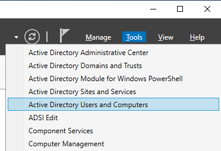
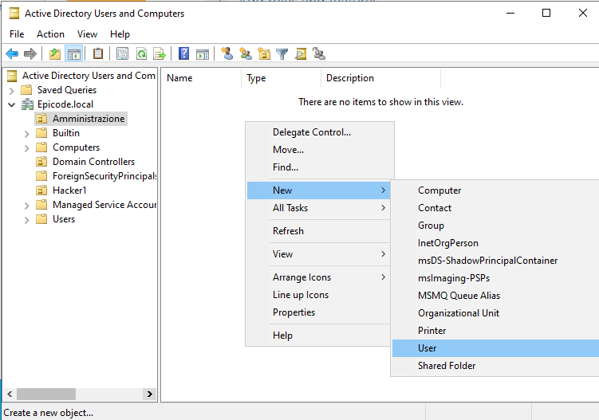
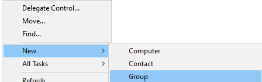
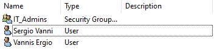
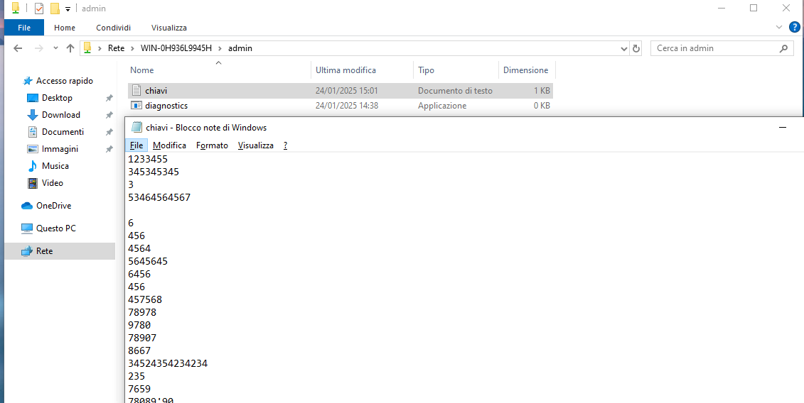
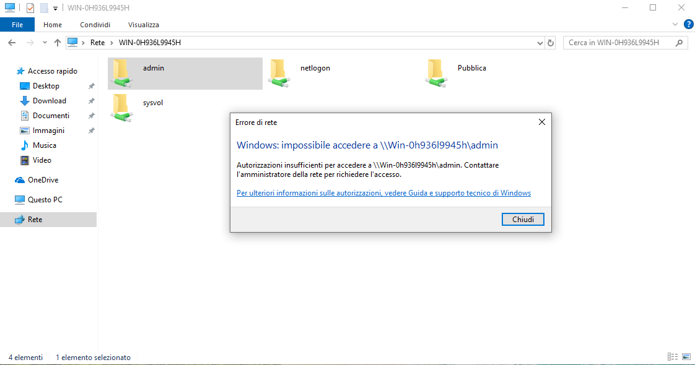
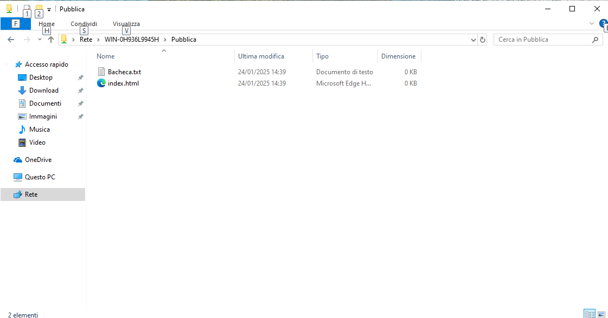
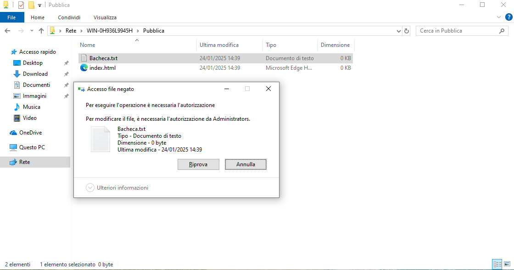
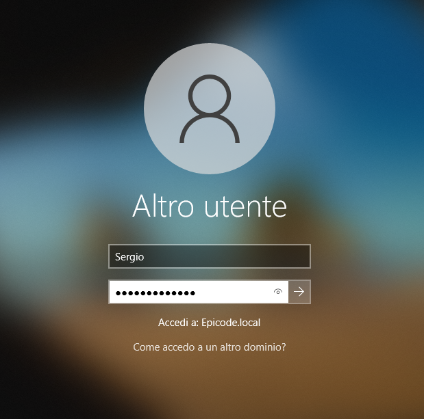

# 📐 Progetto S10/L5 📐
# Creazione e Gestione di Gruppi e Permessi su Windows Server

## 🚀 Introduzione
In questo progetto, abbiamo configurato un ambiente **Windows Server 2022** per gestire utenti, gruppi e risorse condivise. L'obiettivo è stato quello di:

1. ✅ Creare due Organizational Units (OU) con relativi utenti e gruppi.
2. ✅ Configurare i permessi per le cartelle condivise:
   - **Pubblica**: accessibile a tutti ma con limitazioni per gli utenti standard.
   - **ADMIN**: accessibile solo agli amministratori.
3. ✅ Verificare che i permessi funzionino correttamente.

---

## 🏗️ Struttura del Progetto

### 1. Creazione delle OU, Utenti e Gruppi

#### Passaggio 1: Accesso a Active Directory Users and Computers

- Dal **Server Manager**, clicca su **Tools** > **Active Directory Users and Computers**.

#### Passaggio 2: Creazione di Organizational Units (OU)

- Nella struttura **Epicode.local**, ho creato due OU:
  - **Amministrazione**
  - **Utenti Standard**

#### Passaggio 3: Creazione degli Utenti

- All'interno di ogni OU, ho aggiunto utenti pertinenti:
  - **Amministrazione**:
    - *Sergio Vanni* 🧑‍💼
    - *Vannis Ergio* 🧑‍💼
  - **Utenti Standard**:
    - *Utente1* 👤
    - *Utente2* 👤

#### Passaggio 4: Creazione dei Gruppi

- Ho creato i seguenti gruppi, associati ai relativi utenti per zona:
  - **IT_Admins** (in *Amministrazione*).
  - **UtentiStandard** (in *Utenti Standard*).

---

### 2. Configurazione delle Cartelle e dei Permessi

#### Cartella **ADMIN** 🔒

- **Path**: `C:\ADMIN`
- **Permessi**:
  - ✅ Accesso completo (Full Control) per **IT_Admins**.

  - ❌ Nessun accesso per **UtentiStandard**.

#### Cartella **Pubblica** 🌐

- Ho verificato che utenti come *Sergio Vanni* possano accedere e modificare i file.
- Gli utenti standard ricevono un errore di accesso negato:

- **Path**: `C:\Pubblica`
- **Permessi**:
  - ✅ Accessibile da tutti i gruppi.
  - ❌ Modifica vietata per **UtentiStandard** (permessi in sola lettura).

- Ho verificato che gli utenti standard possano aprire ma non modificare i file.

---

### 3. Condivisione delle Cartelle in Rete

#### Passaggio 1: Condivisione della Cartella **ADMIN** 🔗

- Ho condiviso la cartella **ADMIN** con il gruppo **IT_Admins** attraverso le **proprietà di condivisione avanzata**.
- Ho verificato che solo gli amministratori possano accedere in rete.

#### Passaggio 2: Condivisione della Cartella **Pubblica** 🌐

- Ho condiviso la cartella **Pubblica**, garantendo l'accesso completo solo agli amministratori e limitando le modifiche per gli utenti standard.

---

### 4. Verifica dei Permessi

#### Test Utenti **IT_Admins** 🛠️

- ✅ Accesso completo a **ADMIN** e **Pubblica**.
- ✅ Possibilità di modificare file e aggiungere nuovi contenuti.

#### Test Utenti **UtentiStandard** 🚫

- ✅ Accesso limitato a **Pubblica** (solo lettura).
- ❌ Impossibilità di accedere a **ADMIN** (errore di rete confermato).

---

## 🎯 Conclusione

Il progetto si è concluso con successo. 💪🎉

Abbiamo creato un ambiente sicuro e ben organizzato su Windows Server 2022, rispettando le best practice di gestione utenti e risorse. Questo walkthrough è una guida utile per chiunque voglia replicare un setup simile.

Grazie per l'attenzione! 😊
